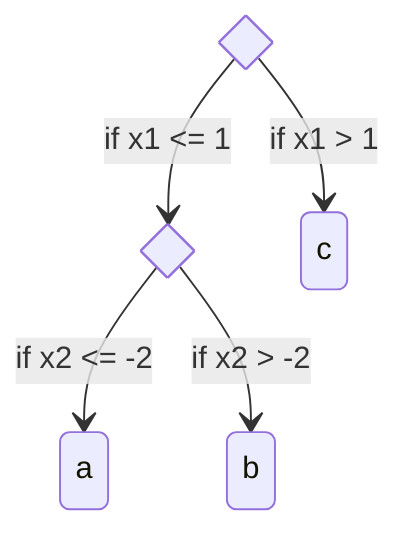

# Overview of Stochastic Tree Models

Stochastic tree models are a powerful addition to your modeling toolkit.
As with many machine learning methods, understanding these models in depth is an involved task.

There are many excellent published papers on stochastic tree models 
(to name a few, the [original BART paper](https://projecteuclid.org/journals/annals-of-applied-statistics/volume-4/issue-1/BART-Bayesian-additive-regression-trees/10.1214/09-AOAS285.full), 
[the XBART paper](https://www.tandfonline.com/doi/full/10.1080/01621459.2021.1942012), 
and [the BCF paper](https://projecteuclid.org/journals/bayesian-analysis/volume-15/issue-3/Bayesian-Regression-Tree-Models-for-Causal-Inference--Regularization-Confounding/10.1214/19-BA1195.full)). 
Here, we aim to build up an abbreviated intuition for these models from their conceptually-simple building blocks.

## Notation

We're going to introduce some notation to make these concepts precise.
In a traditional supervised learning setting, we hope to predict some **outcome** from **features** in a training dataset.
We'll call the outcome $y$ and the features $X$.
Our goal is to come up with a function $f$ that predicts the outcome $y$ as well as possible from $X$ alone. 

## Decision Trees

[Decision tree learning](https://en.wikipedia.org/wiki/Decision_tree_learning) is a simple machine learning method that 
constructs a function $f$ from a series of conditional statements. Consider the tree below.

We evaluate two conditional statments (`X[,1] > 1` and `X[,2] > -2`), arranged in a tree-like sequence of branches, 
which determine whether the model predicts `a`, `b`, or `c`. We could similarly express this tree in math notation as 

\begin{equation*}
f(X_i) = \begin{cases}
a & ; \;\;\; X_{i,1} \leq 1, \;\; X_{i,2} \leq -2\\
b & ; \;\;\; X_{i,1} \leq 1, \;\; X_{i,2} > -2\\
c & ; \;\;\; X_{i,1} > 1
\end{cases}
\end{equation*}

We won't belabor the discussion of trees as there are many good textbooks and online articles on the topic, 
but we'll close by noting that training decision trees introduces a delicate balance between 
[overfitting and underfitting](https://en.wikipedia.org/wiki/Overfitting). 
Simple trees like the one above do not capture much complexity in a dataset and may potentially be underfit 
while deep, complex trees are vulnerable to overfitting and tend to have high variance.

## Boosted Decision Tree Ensembles

One way to address the overfitting-underfitting tradeoff of decision trees is to build an "ensemble" of decision 
trees, so that the function $f$ is defined by a sum of $k$ individual decision trees $g_i$

\begin{equation*}
f(X_i) = g_1(X_i) + \dots + g_k(X_i)
\end{equation*}

There are several ways to train an ensemble of decision trees (sometimes called "forests"), the most popular of which are [random forests](https://en.wikipedia.org/wiki/Random_forest) and 
[gradient boosting](https://en.wikipedia.org/wiki/Gradient_boosting). Their main difference is that random forests train 
all $m$ trees independently of one another, while boosting trains tree sequentially, so that tree $j$ depends on the result of training trees 1 through $j-1$.
Libraries like [xgboost](https://xgboost.readthedocs.io/en/stable/) and [LightGBM](https://lightgbm.readthedocs.io/en/latest/) are popular examples of boosted tree ensembles.

Tree ensembles often [outperform neural networks and other machine learning methods on tabular datasets](https://arxiv.org/abs/2207.08815), 
but classic tree ensemble methods return a single estimated function $f$, without expressing uncertainty around its estimates.

## Stochastic Tree Ensembles

[Stochastic](https://en.wikipedia.org/wiki/Stochastic) tree ensembles differ from their classical counterparts in their use of randomness in learning a function. 
Rather than returning a single "best" tree ensemble, stochastic tree ensembles return a range of tree ensembles that fit the data well.
Mechanically, it's useful to think of "sampling" -- rather than "fitting" -- a stochastic tree ensemble model.

Why is this useful? Suppose we've sampled $m$ forests. For each observation $i$, we obtain $m$ predictions: $[f_1(X_i), \dots, f_m(X_i)]$. 
From this "dataset" of predictions, we can compute summary statistics, where a mean or median would give something akin to the predictions of an xgboost or lightgbm model, 
and the $\alpha$ and $1-\alpha$ quantiles give a [credible interval](https://en.wikipedia.org/wiki/Credible_interval).

Rather than explain each of the models that `stochtree` supports in depth here, we provide a high-level overview, with pointers to the relevant literature.

### Supervised Learning

The [`bart`](R_docs/pkgdown/reference/bart.html) R function and the [`BARTModel`](python_docs/api/bart.md) python class are the primary interface for supervised 
prediction tasks in `stochtree`. The primary references for these models are 
[BART (Chipman, George, McCulloch 2010)](https://projecteuclid.org/journals/annals-of-applied-statistics/volume-4/issue-1/BART-Bayesian-additive-regression-trees/10.1214/09-AOAS285.full) and 
[XBART (He and Hahn 2021)](https://www.tandfonline.com/doi/full/10.1080/01621459.2021.1942012).

In addition to the standard BART / XBART models, in which each tree's leaves return a constant prediction, `stochtree` also supports 
arbitrary leaf regression on a user-provided basis (i.e. an expanded version of [Chipman et al 2002](https://link.springer.com/article/10.1023/A:1013916107446) and [Gramacy and Lee 2012](https://www.tandfonline.com/doi/abs/10.1198/016214508000000689)).

### Causal Inference

The [`bcf`](R_docs/pkgdown/reference/bcf.html) R function and the [`BCFModel`](python_docs/api/bcf.md) python class are the primary interface for causal effect 
estimation in `stochtree`. The primary references for these models are 
[BCF (Hahn, Murray, Carvalho 2021)](https://projecteuclid.org/journals/bayesian-analysis/volume-15/issue-3/Bayesian-Regression-Tree-Models-for-Causal-Inference--Regularization-Confounding/10.1214/19-BA1195.full) and 
[XBCF (Krantsevich, He, Hahn 2022)](https://arxiv.org/abs/2209.06998).

### Additional Modeling Features

Both the BART and BCF interfaces in `stochtree` support the following extensions:

* Accelerated / "warm-start" sampling of forests (i.e. [He and Hahn 2021](https://www.tandfonline.com/doi/full/10.1080/01621459.2021.1942012))
* Forest-based heteroskedasticity (i.e. [Murray 2021](https://www.tandfonline.com/doi/abs/10.1080/01621459.2020.1813587))
* Additive random effects (i.e. [Gelman et al 2008](https://www.tandfonline.com/doi/abs/10.1198/106186008X287337))
