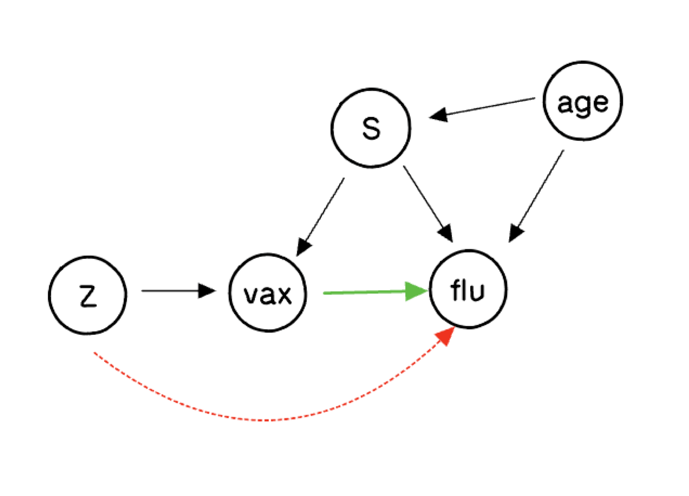

<style type="text/css">
  .table {width: 25%;}
</style>

```{r setup, include=FALSE}
knitr::opts_chunk$set(echo = TRUE)
```

# Introduction

Here we consider a causal inference problem with a binary treatment and a binary outcome where there
is unobserved confounding, but an exogenous instrument is available (also binary). This problem will require a number of extensions to the basic BART model, all of which can be implemented straightforwardly as Gibbs samplers using `stochtree`. We'll go through all of the model fitting steps in quite a lot of detail here.

# Background 

To be concrete, suppose we wish to measure the effect of receiving a flu vaccine on the probability of getting the flu. Individuals who opt to get a flu shot differ in many ways from those that don't, and these lifestyle differences presumably also affect their respective chances of getting the flu. Consequently, comparing the percentage of individuals who get the flu in the vaccinated and unvaccinated groups does not give a clear picture of the vaccine efficacy. 

However, a so-called encouragement design can be implemented, where some individuals are selected at random to be given some extra incentive to get a flu shot (free clinics at the workplace or a personalized reminder, for example). Studying the impact of this randomized encouragement allows us to tease apart the impact of the vaccine from the confounding factors, at least to some extent. This exact problem has been considered several times in the literature, starting with @mcdonald1992effects with follow-on analysis by @hirano2000assessing, @richardson2011transparent, and @imbens2015causal.

Our analysis here follows the Bayesian nonparametric approach described in the supplement to @hahn2016bayesian.

## Notation

Let $V$ denote the treatment variable (as in "vaccine"). Let $Y$ denote the response variable (getting the flu), $Z$ denote the instrument (encouragement or reminder to get a flu shot), and $X$ denote an additional observable covariate (for instance, patient age).

Further, let $S$ denote the so-called *principal strata*, which is an exhaustive characterization of how individuals' might be affected by the encouragement regarding the flu shot. Some people will get a flu shot no matter what: these are the *always takers* (a). Some people will not get the flu shot no matter what: these are the *never takers* (n). For both always-takers and never-takers, the randomization of the encouragement is irrelevant and our data set contains no always takers who skipped the vaccine and no never takers who got the vaccine and so the treatment effect of the vaccine in these groups is fundamentally non-identifiable. 

By contrast, we also have *compliers* (c): folks who would not have gotten the shot but for the fact that they were encouraged to do so. These are the people about whom our randomized encouragement provides some information, because they are precisely the ones that have been randomized to treatment. 

Lastly, we could have *defiers* (d): contrarians who who were planning on getting the shot, but -- upon being reminded -- decided not to! For our analysis we will do the usual thing of assuming that there are no defiers. And because we are going to simulate our data, we can make sure that this assumption is true. 

## The causal diagram

The causal diagram for this model can be expressed as follows. Here we are considering one confounder and moderator variable ($X$), which is the patient's age. In our data generating process (which we know because this is a simulation demonstration) higher age will make it more likely that a person is an always taker or complier and less likely that they are a never taker, which in turn has an effect on flu risk. We stipulate here that always takers are at lower risk and never takers at higher risk. Simultaneously, age has an increasing and then decreasing direct effect on flu risk; very young and very old are at higher risk, while young and middle age adults are at lower risk. In this DGP the flu efficacy has a multiplicative effect, reducing flu risk as a fixed proportion of baseline risk -- accordingly, the treatment effect (as a difference) is nonlinear in Age (for each principal stratum).

```{r pressure, echo=FALSE, fig.cap="The causal directed acyclic graph (CDAG) for the instrumental variables flu example.", fig.align="center", out.width = '50%'}

```

The biggest question about this graph concerns the dashed red arrow from the putative instrument $Z$ to the outcome (flu). We say "putative" because if that dashed red arrow is there, then technically $Z$ is not a valid instrument. The assumption/assertion that there is no dashed red arrow is called the "exclusion restriction". In this vignette, we will explore what sorts of inferences are possible if we remain agnostic about the presence or absence of that dashed red arrow.

## Potential outcomes

There are two relevant potential outcomes in an instrumental variables analysis, corresponding to the causal effect of the instrument on the treatment and the causal effect of the treatment on the outcome. In this example, that is the effect of the reminder/encouragement on vaccine status and the effect of the vaccine itself on the flu. The notation is $V(Z)$ and $Y(V(Z),Z)$ respectively, so that we have six distinct random variables: $V(0)$, $V(1)$, $Y(0,0)$, $Y(1,0)$, $Y(0,1)$ and $Y(1,1)$. The problem -- sometimes called the *fundamental problem of causal inference* -- is that some of these random variables can never be seen simultaneously, they are observationally mutually exclusive. For this reason, it may be helpful to think about causal inference as a missing data problem, as depicted in the following table. 

```{r missing_data, echo=FALSE}
d <- data.frame(i = c(1:4, "$\\vdots$"), z = c(1,0,0,1, "$\\vdots$"),v0=c("?",1,0,"?", "$\\vdots$"),v1=c(1,"?","?",0, "$\\vdots$"), y00 = c("?","?",1,"?",  "$\\vdots$"), y10 = c("?",1,"?","?", "$\\vdots$"), y01 = c("?","?","?",0,  "$\\vdots$"), y11 = c(0,"?","?","?",  "$\\vdots$"))
library(kableExtra)
colnames(d) <- c("$i$","$Z_i$", "$V_i(0)$","$V_i(1)$","$Y_i(0,0)$","$Y_i(1,0)$","$Y_i(0,1)$","$Y_i(1,1)$")
knitr::kable(d, escape = FALSE, align = 'c') %>% kable_styling("striped", position = "center")
```

Likewise, with this notation we can formally define the principal strata:

```{r principle_strata, echo=FALSE}
d <- data.frame(v0=c(0,1,0,1),v1=c(0,1,1,0), S = c("Never Taker (n)", "Always Taker (a)", "Complier (c)", "Defier (d)"))
colnames(d) <- c("$V_i(0)$","$V_i(1)$","$S_i$")
knitr::kable(d, escape = FALSE, align='c')  %>% kable_styling("striped", position = "center")
```
 
## Estimands and Identification

Let $\pi_s(x)$ denote the conditional (on $x$) probability that an individual belongs to principal stratum $s$:
\begin{equation}
\pi_s(x)=\operatorname{Pr}(S=s \mid X=x),
\end{equation}
and let $\gamma_s^{v z}(x)$ denote the potential outcome probability for given values $v$ and $z$:
\begin{equation}
\gamma_s^{v z}(x)=\operatorname{Pr}(Y(v, z)=1 \mid S=s, X=x). 
\end{equation}

Various estimands of interest may be expressed in terms of the functions $\gamma_c^{vz}(x)$. In particular, the complier conditional average treatment effect $$\gamma_c^{1,z}(x) - \gamma_c^{0,z}(x)$$ is the ultimate goal (for either $z=0$ or $z=1$). Under an exclusion restriction, we would have $\gamma_s^{vz}(x) = \gamma_s^{v}(x)$ and the reminder status $z$ itself would not matter. In that case, we can estimate $$\gamma_c^{1,z}(x) - \gamma_c^{0,z}$$ and $$\gamma_c^{1,1}(x) - \gamma_c^{0,0}(x).$$ This latter quantity is called the complier intent-to-treat effect, or $ITT_c$, and it can be partially identify even if the exclusion restriction is violated, as follows. 

The left-hand side of the following system of equations are all estimable quantities that can be learned from observable data, while the right hand side expressions involve the unknown functions of interest,  $\gamma_s^{vz}(x)$:

\begin{equation}
\begin{aligned}
p_{1 \mid 00}(x) = \operatorname{Pr}(Y=1 \mid V=0, Z=0, X=x)=\frac{\pi_c(x)}{\pi_c(x)+\pi_n(x)} \gamma_c^{00}(x)+\frac{\pi_n(x)}{\pi_c(x)+\pi_n(x)} \gamma_n^{00}(x) \\
p_{1 \mid 11}(x) =\operatorname{Pr}(Y=1 \mid V=1, Z=1, X=x)=\frac{\pi_c(x)}{\pi_c(x)+\pi_a(x)} \gamma_c^{11}(x)+\frac{\pi_a(x)}{\pi_c(x)+\pi_a(x)} \gamma_a^{11}(x) \\
p_{1 \mid 01}(x) =\operatorname{Pr}(Y=1 \mid V=0, Z=1, X=x)=\frac{\pi_d(x)}{\pi_d(x)+\pi_n(x)} \gamma_d^{01}(x)+\frac{\pi_n(x)}{\pi_d(x)+\pi_n(x)} \gamma_n^{01}(x) \\
p_{1 \mid 10}(x) =\operatorname{Pr}(Y=1 \mid V=1, Z=0, X=x)=\frac{\pi_d(x)}{\pi_d(x)+\pi_a(x)} \gamma_d^{10}(x)+\frac{\pi_a(x)}{\pi_d(x)+\pi_a(x)} \gamma_a^{10}(x)
\end{aligned}
\end{equation}

Furthermore, we have
\begin{equation}
\begin{aligned}
\operatorname{Pr}(V=1 \mid Z=0, X=x)&=\pi_a(x)+\pi_d(x)\\
\operatorname{Pr}(V=1 \mid Z=1, X=x)&=\pi_a(x)+\pi_c(x)
\end{aligned}
\end{equation}

Under the monotonicy assumption, $\pi_d(x) = 0$ and these expressions simplify somewhat.
\begin{equation}
\begin{aligned}
p_{1 \mid 00}(x)&=\frac{\pi_c(x)}{\pi_c(x)+\pi_n(x)} \gamma_c^{00}(x)+\frac{\pi_n(x)}{\pi_c(x)+\pi_n(x)} \gamma_n^{00}(x) \\
p_{1 \mid 11}(x)&=\frac{\pi_c(x)}{\pi_c(x)+\pi_a(x)} \gamma_c^{11}(x)+\frac{\pi_a(x)}{\pi_c(x)+\pi_a(x)} \gamma_a^{11}(x) \\
p_{1 \mid 01}(x)&=\gamma_n^{01}(x) \\
p_{1 \mid 10}(x)&=\gamma_a^{10}(x)
\end{aligned}
\end{equation}
and
\begin{equation}
\begin{aligned}
\operatorname{Pr}(V=1 \mid Z=0, X=x)&=\pi_a(x)\\
\operatorname{Pr}(V=1 \mid Z=1, X=x)&=\pi_a(x)+\pi_c(x)
\end{aligned}
\end{equation}

The exclusion restriction would dictate that $\gamma_s^{01}(x) = \gamma_s^{00}(x)$ and $\gamma_s^{11}(x) = \gamma_s^{10}(x)$ for all $s$. This has two implications. One, $\gamma_n^{01}(x) = \gamma_n^{00}(x)$ and $\gamma_a^{10}(x) = \gamma_a^{11}(x)$,and because the left-hand terms are identified, this permits $\gamma_c^{11}(x)$ and $\gamma_c^{00}(x)$ to be solved for by substitution. Two, with these two quantities solved for, we also have the two other quantities (the different settings of $z$), since $\gamma_c^{11}(x) = \gamma_c^{10}(x)$ and $\gamma_c^{00}(x) = \gamma_c^{01}(x)$. Consequently, both of our estimands from above can be estimated:

$$\gamma_c^{11}(x) - \gamma_c^{01}(x)$$
and 

$$\gamma_c^{10}(x) - \gamma_c^{00}(x)$$
because they are both (supposing the exclusion restriction holds) the same as

$$\gamma_c^{11}(x) - \gamma_c^{00}(x).$$
If the exclusion restriction does *not* hold, then the three above treatment effects are all (potentially) distinct and not much can be said about the former two. The latter one, the $ITT_c$, however, can be partially identified, by recognizing that the first two equations (in our four equation system) provide non-trivial bounds based on the fact that while $\gamma_c^{11}(x)$ and $\gamma_c^{00}(x)$ are no longer identified, as probabilities both must lie between 0 and 1. Thus, 

\begin{equation}
\begin{aligned}
	\max\left(
		0, \frac{\pi_c(x)+\pi_n(x)}{\pi_c(x)}p_{1\mid 00}(x) - \frac{\pi_n(x)}{\pi_c(x)}
	\right)
&\leq\gamma^{00}_c(x)\leq
	\min\left(
		1, \frac{\pi_c(x)+\pi_n(x)}{\pi_c(x)}p_{1\mid 00}(x)
	\right)\\\\
%
\max\left(
  0, \frac{\pi_a(x)+\pi_c(x)}{\pi_c(x)}p_{1\mid 11}(x) - \frac{\pi_a(x)}{\pi_c(x)}
\right)
&\leq\gamma^{11}_c(x)\leq
\min\left(
  1, \frac{\pi_a(x)+\pi_c(x)}{\pi_c(x)}p_{1\mid 11}(x)
\right)
\end{aligned}
\end{equation}

The point of all this is that the data (plus a no-defiers assumption) lets us estimate all the necessary inputs to these upper and lower bounds on $\gamma^{11}_c(x)$ and $\gamma^{00}_c(x)$ which in turn define our estimand. What remains is to estimate those inputs, as functions of $x$, and to do so while enforcing the monotonicty restriction $$\operatorname{Pr}(V=1 \mid Z=0, X=x)=\pi_a(x) \leq 
\operatorname{Pr}(V=1 \mid Z=1, X=x)=\pi_a(x)+\pi_c(x).$$

We can do all of this with calls to stochtree from R (or Python). But first, let's generate some test data. 

### Simulate the data

Start with some initial setup / housekeeping

```{r preliminaries}
library(stochtree)

# size of the training sample
n <- 20000

# To set the seed for reproducibility/illustration purposes, replace "NULL" with a positive integer
random_seed <- NULL
```

First, we generate the instrument exogenously

```{r instrument}
z <- rbinom(n, 1, 0.5)
```

Next, we generate the covariate. (For this example, let's think of it as patient age, although we are generating it from a uniform distribution between 0 and 3, so you have to imagine that it has been pre-standardized to this scale. It keeps the DGPs cleaner for illustration purposes.)

```{r covariate}
p_X <- 1
X <- matrix(runif(n*p_X, 0, 3), ncol = p_X)
x <- X[,1] # for ease of reference later
```

Next, we generate the principal strata $S$ based on the observed value of $X$. We generate it according to a logistic regression with two coefficients per strata, an intercept and a slope. Here, these coefficients are set so that the probability of being a never taker decreases with age.

```{r principal strata}
alpha_a <- 0
beta_a <- 1

alpha_n <- 1
beta_n <- -1

alpha_c <- 1
beta_c <- 1

# define function (a logistic model) to generate Pr(S = s | X = x)
pi_s <- function(xval){
  
  w_a <- exp(alpha_a + beta_a*xval)
  w_n <- exp(alpha_n + beta_n*xval)
  w_c <- exp(alpha_c + beta_c*xval)
   
  w <- cbind(w_a, w_n, w_c)
  colnames(w) <- c("w_a","w_n","w_c")
  w <- w/rowSums(w)
  
  return(w)
  
}
s <- sapply(1:n, function(j) sample(c("a","n","c"), 1, prob = pi_s(X[j,1])))
```

Next, we generate the treatment variable, here denoted $V$ (for "vaccine"), as a *deterministic* function of $S$ and $Z$; this is what gives the principal strata their meaning.

```{r vaccine}
v <- 1*(s=="a") + 0*(s=="n") + z*(s=="c") + (1-z)*(s == "d")
```

Finally, the outcome structural model is specified, based on which the outcome is sampled. By varying this function in particular ways, we can alter the identification conditions.

```{r ymodel}
gamfun <- function(xval,vval, zval,sval){
  
  # if this function depends on zval, then exclusion restriction is violated
  # if this function does not depend on sval, then IV analysis wasn't necessary
  # if this function does not depend on x, then there are no HTEs
  
  baseline <- pnorm(2 -1*xval - 2.5*(xval-1.5)^2 - 0.5*zval + 1*(sval=="n") - 1*(sval=="a") )
  prob <- baseline - 0.5*vval*baseline # 0.5*vval*baseline
  
  return(prob)
}

# Generate the observed outcome
y <- rbinom(n, 1, gamfun(X[,1],v,z,s))
```

Lastly, we perform some organization for our supervised learning algorithms later on. 

```{r organizedata}
# Concatenate X, v and z for our supervised learning algorithms
Xall <- cbind(X,v,z)

# update the size of "X" to be the size of Xall
p_X <- p_X + 2

# For the monotone probit model it is necessary to sort the observations so that the Z=1 cases are all together
# at the start of the outcome vector.  
index <- sort(z,decreasing = TRUE, index.return = TRUE)

X <- matrix(X[index$ix,],ncol= 1)
Xall <- Xall[index$ix,]
z <- z[index$ix]
v <- v[index$ix]
s <- s[index$ix]
y <- y[index$ix]
x <- x[index$ix]
```

Now let's see if we can recover these functions from the observed data. 


### Fit the outcome model

We have to fit three models here, the treatment models: $\operatorname{Pr}(V = 1 | Z = 1, X=x)$ and $\operatorname{Pr}(V = 1 | Z = 0,X = x)$, subject to the monotonicity constraint  $\operatorname{Pr}(V = 1 | Z = 1, X=x) \geq \operatorname{Pr}(V = 1 | Z = 0,X = x)$, and an outcome model $\operatorname{Pr}(Y = 1 | Z = 1, V = 1, X = x)$. All of this will be done with stochtree. 

The outcome model is fit with a single (S-learner) BART model. This part of the model could be fit as a T-Learner or as a BCF model. Here we us an S-Learner for simplicity. Both models are probit models, and use the well-known @albert1993bayesian data augmentation Gibbs sampler. This section covers the more straightforward outcome model. The next section describes how the monotonicity constraint is handled with a data augmentation Gibbs sampler. 

These models could (and probably should) be wrapped as functions. Here they are implemented as scripts, with the full loops shown. The output -- at the end of the loops -- are stochtree forest objects from which we can extract posterior samples and generate predictions. In particular, the $ITT_c$ will be constructed using posterior counterfactual predictions derived from these forest objects. 

We begin by setting a bunch of hyperparameters and instantiating the forest objects to be operated upon in the main sampling loop. We also initialize the latent variables.

```{r outcomefit1}
# Fit the BART model for Pr(Y = 1 | Z = 1, V = 1, X = x)

# Set number of iterations
num_warmstart <- 10
num_mcmc <- 1000
num_samples <- num_warmstart + num_mcmc

# Set a bunch of hyperparameters. These are ballpark default values.
alpha <- 0.95
beta <- 2
min_samples_leaf <- 1
max_depth <- 20
num_trees <- 50
cutpoint_grid_size = 100
global_variance_init = 1.
tau_init = 0.5
leaf_prior_scale = matrix(c(tau_init), ncol = 1)
a_leaf <- 2.
b_leaf <- 0.5
leaf_regression <- F
feature_types <- as.integer(c(rep(0, p_X-2),1,1)) # 0 = numeric
var_weights <- rep(1,p_X)/p_X
outcome_model_type <- 0

# C++ dataset
forest_dataset <- createForestDataset(Xall)

# Random number generator (std::mt19937)
if (is.null(random_seed)) {
    rng <- createCppRNG(-1)
} else {
    rng <- createCppRNG(random_seed)
}

# Sampling data structures
forest_model_config <- createForestModelConfig(
  feature_types = feature_types, num_trees = num_trees, num_features = p_X, 
  num_observations = n, variable_weights = var_weights, leaf_dimension = 1, 
  alpha = alpha, beta = beta, min_samples_leaf = min_samples_leaf, 
  max_depth = max_depth, leaf_model_type = outcome_model_type, 
  leaf_model_scale = leaf_prior_scale, cutpoint_grid_size = cutpoint_grid_size
)
global_model_config <- createGlobalModelConfig(global_error_variance = 1)
forest_model <- createForestModel(forest_dataset, forest_model_config, global_model_config)

# Container of forest samples
forest_samples <- createForestSamples(num_trees, 1, T, F)

# "Active" forest state
active_forest <- createForest(num_trees, 1, T, F)

# Initialize the latent outcome zed
n1 <- sum(y)
zed <- 0.25*(2*as.numeric(y) - 1)

# C++ outcome variable
outcome <- createOutcome(zed)

# Initialize the active forest and subtract each root tree's predictions from outcome
active_forest$prepare_for_sampler(forest_dataset, outcome, forest_model, outcome_model_type, 0.0)
active_forest$adjust_residual(forest_dataset, outcome, forest_model, FALSE, FALSE)
```

Now we enter the main loop, which involves only two steps: sample the forest, given the latent utilities, then sample the latent utilities given the estimated conditional means defined by the forest and its parameters. 

```{r outcomefit2}
# Initialize the Markov chain with num_warmstart grow-from-root iterations
gfr_flag <- T
for (i in 1:num_samples) {
  
  # The first num_warmstart iterations use the grow-from-root algorithm of He and Hahn
  if (i > num_warmstart){
    gfr_flag <- F
  } 
  
  # Sample forest
  forest_model$sample_one_iteration(
    forest_dataset, outcome, forest_samples, active_forest, 
    rng, forest_model_config, global_model_config, 
    keep_forest = T, gfr = gfr_flag
  )
  
  # Get the current means
  eta <- forest_samples$predict_raw_single_forest(forest_dataset, i-1)
  
  # Sample latent normals, truncated according to the observed outcome y
  U1 <- runif(n1,pnorm(0,eta[y==1],1),1)
  zed[y==1] <- qnorm(U1,eta[y==1],1)
  U0 <- runif(n - n1,0, pnorm(0,eta[y==0],1))
  zed[y==0] <- qnorm(U0,eta[y==0],1)
  
  # Propagate the newly sampled latent outcome to the BART model
  outcome$update_data(zed)
  forest_model$propagate_residual_update(outcome)
}
```

### Fit the monotone probit model(s)

The monotonicty constraint relies on a data augmentation as described in @papakostas2023forecasts. The implementation of this sampler is inherently cumbersome, as one of the "data" vectors is constructed from some observed data and some latent data and there are two forest objects, one of which applies to all of the observations and one of which applies to only those observations with $Z = 0$. We go into more details about this sampler in a dedicated vignette. Here we include the code, but without producing the equations derived in @papakostas2023forecasts. What is most important is simply that  

\begin{equation}
\begin{aligned}
\operatorname{Pr}(V=1 \mid Z=0, X=x)&=\pi_a(x) = \Phi_f(x)\Phi_h(x),\\
\operatorname{Pr}(V=1 \mid Z=1, X=x)&=\pi_a(x)+\pi_c(x) = \Phi_f(x),
\end{aligned}
\end{equation}
where $\Phi_{\mu}(x)$ denotes the normal cumulative distribution function with mean $\mu(x)$ and variance 1. 

We first create a secondary data matrix for the $Z=0$ group only. We also set all of the hyperparameters and initialize the latent variables.

```{r treatmentfit1}
# Fit the monotone probit model to the treatment such that Pr(V = 1 | Z = 1, X=x) >= Pr(V = 1 | Z = 0,X = x) 

X_h <- as.matrix(X[z==0,])
n0 <- sum(z==0)
n1 <- sum(z==1)

num_trees_f <- 50
num_trees_h <- 20
feature_types <- as.integer(rep(0, 1)) # 0 = numeric
var_weights <- rep(1,1)
cutpoint_grid_size = 100
global_variance_init = 1.
tau_init = 1/num_trees_h
leaf_prior_scale = matrix(c(tau_init), ncol = 1)
nu <- 4
lambda <- 0.5
a_leaf <- 2.
b_leaf <- 0.5
leaf_regression <- F # fit a constant leaf mean BART model

# Instantiate the C++ dataset objects
forest_dataset_f <- createForestDataset(X)
forest_dataset_h <- createForestDataset(X_h)

# Tell it we're fitting a normal BART model
outcome_model_type <- 0

# Set up model configuration objects
forest_model_config_f <- createForestModelConfig(
  feature_types = feature_types, num_trees = num_trees_f, num_features = ncol(X), 
  num_observations = nrow(X), variable_weights = var_weights, leaf_dimension = 1, 
  alpha = alpha, beta = beta, min_samples_leaf = min_samples_leaf, 
  max_depth = max_depth, leaf_model_type = outcome_model_type, 
  leaf_model_scale = leaf_prior_scale, cutpoint_grid_size = cutpoint_grid_size
)
forest_model_config_h <- createForestModelConfig(
  feature_types = feature_types, num_trees = num_trees_h, num_features = ncol(X_h), 
  num_observations = nrow(X_h), variable_weights = var_weights, leaf_dimension = 1, 
  alpha = alpha, beta = beta, min_samples_leaf = min_samples_leaf, 
  max_depth = max_depth, leaf_model_type = outcome_model_type, 
  leaf_model_scale = leaf_prior_scale, cutpoint_grid_size = cutpoint_grid_size
)
global_model_config <- createGlobalModelConfig(global_error_variance = 1)

# Instantiate the sampling data structures
forest_model_f <- createForestModel(forest_dataset_f, forest_model_config_f, global_model_config)
forest_model_h <- createForestModel(forest_dataset_h, forest_model_config_h, global_model_config)

# Instantiate containers of forest samples
forest_samples_f <- createForestSamples(num_trees_f, 1, T)
forest_samples_h <- createForestSamples(num_trees_h, 1, T)

# Instantiate "active" forests
active_forest_f <- createForest(num_trees_f, 1, T)
active_forest_h <- createForest(num_trees_h, 1, T)

# Set algorithm specifications 
# these are set in the earlier script for the outcome model; number of draws needs to be commensurable 

#num_warmstart <- 10
#num_mcmc <- 2000
#num_samples <- num_warmstart + num_mcmc

# Initialize the Markov chain

# Initialize (R0, R1), the latent binary variables that enforce the monotonicty 

v1 <- v[z==1]
v0 <- v[z==0]

R1 = rep(NA,n0)
R0 = rep(NA,n0)

R1[v0==1] <- 1
R0[v0==1] <- 1

R1[v0 == 0] <- 0
R0[v0 == 0] <- sample(c(0,1),sum(v0==0),replace=TRUE)

# The first n1 observations of vaug are actually observed
# The next n0 of them are the latent variable R1
vaug <- c(v1, R1)

# Initialize the Albert and Chib latent Gaussian variables
z_f <- (2*as.numeric(vaug) - 1)
z_h <- (2*as.numeric(R0)-1)
z_f <- z_f/sd(z_f)
z_h <- z_h/sd(z_h)

# Pass these variables to the BART models as outcome variables
outcome_f <- createOutcome(z_f)
outcome_h <- createOutcome(z_h)

# Initialize active forests to constant (0) predictions
active_forest_f$prepare_for_sampler(forest_dataset_f, outcome_f, forest_model_f, outcome_model_type, 0.0)
active_forest_h$prepare_for_sampler(forest_dataset_h, outcome_h, forest_model_h, outcome_model_type, 0.0)
active_forest_f$adjust_residual(forest_dataset_f, outcome_f, forest_model_f, FALSE, FALSE)
active_forest_h$adjust_residual(forest_dataset_h, outcome_h, forest_model_h, FALSE, FALSE)
```

Now we run the main sampling loop, which consists of three key steps: sample the BART forests, given the latent probit utilities, sampling the latent binary outcome pairs (this is the step that is necessary for enforcing monotonicity), given the forest predictions and the latent utilities, and finally sample the latent utilities.

```{r treatmentfit2}
# PART IV: run the Markov chain 

# Initialize the Markov chain with num_warmstart grow-from-root iterations
gfr_flag <- T
for (i in 1:num_samples) {
  
  # Switch over to random walk Metropolis-Hastings tree updates after num_warmstart
  if (i > num_warmstart) {
    gfr_flag <- F
  }
  
  # Step 1: Sample the BART forests
  
  # Sample forest for the function f based on (y_f, R1)
  forest_model_f$sample_one_iteration(
    forest_dataset_f, outcome_f, forest_samples_f, active_forest_f, 
    rng, forest_model_config_f, global_model_config, 
    keep_forest = T, gfr = gfr_flag
  )
  
  # Sample forest for the function h based on outcome R0
  forest_model_h$sample_one_iteration(
    forest_dataset_h, outcome_h, forest_samples_h, active_forest_h,
    rng, forest_model_config_h, global_model_config, 
    keep_forest = T, gfr = gfr_flag
  )
  
  # Extract the means for use in sampling the latent variables
  eta_f <- forest_samples_f$predict_raw_single_forest(forest_dataset_f, i-1)
  eta_h <- forest_samples_h$predict_raw_single_forest(forest_dataset_h, i-1)
  
  
  # Step 2: sample the latent binary pair (R0, R1) given eta_h, eta_f, and y_g
  
  # Three cases: (0,0), (0,1), (1,0)
  w1 <- (1 - pnorm(eta_h[v0==0]))*(1-pnorm(eta_f[n1 + which(v0==0)]))
  w2 <-   (1 - pnorm(eta_h[v0==0]))*pnorm(eta_f[n1 + which(v0==0)])
  w3 <- pnorm(eta_h[v0==0])*(1 - pnorm(eta_f[n1 + which(v0==0)]))
  
  s <- w1 + w2 + w3
  w1 <- w1/s
  w2 <- w2/s
  w3 <- w3/s
  
  u <- runif(sum(v0==0))
  temp <- 1*(u < w1) + 2*(u > w1 & u < w1 + w2) + 3*(u > w1 + w2)
  
  R1[v0==0] <- 1*(temp==2)
  R0[v0==0] <- 1*(temp==3)
  
  # Redefine y with the updated R1 component 
  vaug <- c(v1, R1)
  
  # Step 3: sample the latent normals, given (R0, R1) and y_f
  
  # First z0
  U1 <- runif(sum(R0),pnorm(0, eta_h[R0==1],1),1)
  z_h[R0==1] <- qnorm(U1, eta_h[R0==1],1)
  
  U0 <- runif(n0 - sum(R0),0, pnorm(0, eta_h[R0==0],1))
  z_h[R0==0] <- qnorm(U0, eta_h[R0==0],1)
  
  # Then z1
  U1 <- runif(sum(vaug),pnorm(0, eta_f[vaug==1],1),1)
  z_f[vaug==1] <- qnorm(U1, eta_f[vaug==1],1)
  
  U0 <- runif(n - sum(vaug),0, pnorm(0, eta_f[vaug==0],1))
  z_f[vaug==0] <- qnorm(U0, eta_f[vaug==0],1)
  
  # Propagate the updated outcomes through the BART models
  outcome_h$update_data(z_h)
  forest_model_h$propagate_residual_update(outcome_h)
  
  outcome_f$update_data(z_f)
  forest_model_f$propagate_residual_update(outcome_f)
  
  # No more steps, just repeat a bunch of times
}
```

### Extracting the estimates and plotting the results.

Now for the most interesting part, which is taking the stochtree BART model fits and producing the causal estimates of interest. 

First we set up our grid for plotting the functions in $X$. This is possible in this example because the moderator, age, is one dimensional; in may applied problems this will not be the case and visualization will be substantially trickier. 

```{r plot1}
# Extract the credible intervals for the conditional treatment effects as a function of x.
# We use a grid of values for plotting, with grid points that are typically fewer than the number of observations.

ngrid <- 200
xgrid <- seq(0.1,2.5,length.out = ngrid)
X_11 <- cbind(xgrid,rep(1,ngrid),rep(1,ngrid))

X_00 <- cbind(xgrid,rep(0,ngrid),rep(0,ngrid))
X_01 <- cbind(xgrid,rep(0,ngrid),rep(1,ngrid))
X_10 <- cbind(xgrid,rep(1,ngrid),rep(0,ngrid))
```

Next, we compute the truth function evaluations on this plotting grid, using the functions defined above when we generated our data. 

```{r plot2}
# Compute the true conditional outcome probabilities for plotting
pi_strat <- pi_s(xgrid)
w_a <- pi_strat[,1]
w_n <- pi_strat[,2]
w_c <- pi_strat[,3]

w <- (w_c/(w_a + w_c))

p11_true <- w*gamfun(xgrid,1,1,"c") + (1-w)*gamfun(xgrid,1,1,"a")

w <- (w_c/(w_n + w_c))

p00_true <- w*gamfun(xgrid,0,0,"c") + (1-w)*gamfun(xgrid,0,0,"n")

# Compute the true ITT_c for plotting and comparison
itt_c_true <- gamfun(xgrid,1,1,"c") - gamfun(xgrid,0,0,"c")

# Compute the true LATE for plotting and comparison
LATE_true0 <- gamfun(xgrid,1,0,"c") - gamfun(xgrid,0,0,"c")
LATE_true1 <- gamfun(xgrid,1,1,"c") - gamfun(xgrid,0,1,"c")
```

Next we populate the data structures for stochtree to operate on, call the predict functions to extract the predictions, convert them to probability scale using the built in `pnorm` function. 

```{r plot3}
# Datasets for counterfactual predictions
forest_dataset_grid <- createForestDataset(cbind(xgrid))
forest_dataset_11 <- createForestDataset(X_11)
forest_dataset_00 <- createForestDataset(X_00)
forest_dataset_10 <- createForestDataset(X_10)
forest_dataset_01 <- createForestDataset(X_01)

# Forest predictions
preds_00 <- forest_samples$predict(forest_dataset_00)
preds_11 <- forest_samples$predict(forest_dataset_11)
preds_01 <- forest_samples$predict(forest_dataset_01)
preds_10 <- forest_samples$predict(forest_dataset_10)

# Probability transformations
phat_00 <- pnorm(preds_00)
phat_11 <- pnorm(preds_11)
phat_01 <- pnorm(preds_01)
phat_10 <- pnorm(preds_10)

# Cleanup
rm(preds_00)
rm(preds_11)
rm(preds_01)
rm(preds_10)


preds_ac <- forest_samples_f$predict(forest_dataset_grid)
phat_ac <- pnorm(preds_ac)

preds_adj <- forest_samples_h$predict(forest_dataset_grid)
phat_a <- pnorm(preds_ac)*pnorm(preds_adj)
rm(preds_adj)
rm(preds_ac)

phat_c <- phat_ac - phat_a

phat_n <- 1 - phat_ac
```

Now we may plot posterior means of various quantities (as a function of $X$) to visualize how well the models are fitting.

```{r plot4, fig.align='center'}
# Set up the plotting window
par(mfrow=c(1,2))

# Plot the fitted outcome probabilities against the truth
plot(p11_true,rowMeans(phat_11),pch=20,cex=0.5,bty='n')
abline(0,1,col='red')

plot(p00_true,rowMeans(phat_00),pch=20,cex=0.5,bty='n')
abline(0,1,col='red')

par(mfrow=c(1,3))
plot(rowMeans(phat_ac),w_c +w_a,pch=20)
abline(0,1,col='red')

plot(rowMeans(phat_a),w_a,pch=20)
abline(0,1,col='red')

plot(rowMeans(phat_c),w_c,pch=20)
abline(0,1,col='red')
```

These plots are not as pretty as we might hope, but mostly this is a function of how difficult it is to learn conditional probabilities from binary outcomes. That we capture the trend broadly turns out to be adequate for estimating treatment effects. Fit does improve with simpler DGPs and larger training sets, as can be confirmed by experimentation with this script. 

Lastly, we can construct the estimate of the $ITT_c$ and compare it to the true value as well as the $Z=0$ and $Z=1$ complier average treatment effects (also called "local average treatment effects" or LATE). The key step in this process is to center our posterior on the identified interval (at each iteration of the sampler) at the value implied by a valid exclusion restriction. For some draws this will not be possible, as that value will be outside the identification region.

```{r plot5, fig.height = 3}
# Generate draws from the posterior of the treatment effect
# centered at the point-identified value under the exclusion restriction
itt_c <- late <- matrix(NA,ngrid, ncol(phat_c))
ss <- 6
for (j in 1:ncol(phat_c)){
  
  # Value of gamma11 implied by an exclusion restriction
  gamest11 <- ((phat_a[,j] + phat_c[,j])/phat_c[,j])*phat_11[,j] - phat_10[,j]*phat_a[,j]/phat_c[,j]
  
  # Identified region for gamma11
  lower11 <- pmax(rep(0,ngrid), ((phat_a[,j] + phat_c[,j])/phat_c[,j])*phat_11[,j] - phat_a[,j]/phat_c[,j])
  upper11 <- pmin(rep(1,ngrid), ((phat_a[,j] + phat_c[,j])/phat_c[,j])*phat_11[,j])
  
  # Center a beta distribution at gamma11, but restricted to (lower11, upper11)
  # do this by shifting and scaling the mean, drawing from a beta on (0,1), then shifting and scaling to the 
  # correct restricted interval
  m11 <- (gamest11 - lower11)/(upper11-lower11)

  # Parameters to the beta
  a1 <- ss*m11
  b1 <- ss*(1-m11)
  
  # When the corresponding mean is out-of-range, sample from a beta with mass piled near the violated boundary
  a1[m11<0] <- 1
  b1[m11<0] <- 5
  
  a1[m11>1] <- 5
  b1[m11>1] <- 1
  
  # Value of gamma00 implied by an exclusion restriction
  gamest00 <- ((phat_n[,j] + phat_c[,j])/phat_c[,j])*phat_00[,j] - phat_01[,j]*phat_n[,j]/phat_c[,j]
  
  # Identified region for gamma00
  lower00 <- pmax(rep(0,ngrid), ((phat_n[,j] + phat_c[,j])/phat_c[,j])*phat_00[,j] - phat_n[,j]/phat_c[,j])
  upper00 <- pmin(rep(1,ngrid), ((phat_n[,j] + phat_c[,j])/phat_c[,j])*phat_00[,j])
  
  # Center a beta distribution at gamma00, but restricted to (lower00, upper00)
  # do this by shifting and scaling the mean, drawing from a beta on (0,1), then shifting and scaling to the 
  # correct restricted interval
  m00 <- (gamest00 - lower00)/(upper00-lower00)
  
  a0 <- ss*m00
  b0 <- ss*(1-m00)
  
  a0[m00<0] <- 1
  b0[m00<0] <- 5
  
  a0[m00>1] <- 5
  b0[m00>1] <- 1
 
  # ITT and LATE    
  itt_c[,j] <- lower11 + (upper11 - lower11)*rbeta(ngrid,a1,b1) - (lower00 + (upper00 - lower00)*rbeta(ngrid,a0,b0))
  late[,j] <- gamest11 - gamest00
}

upperq <- apply(itt_c,1,quantile,0.975)
lowerq <- apply(itt_c,1,quantile,0.025)
```

And now we can plot all of this, using the "polygon" function to shade posterior quantiles. 

```{r plot6, fig.align="center"}
par(mfrow=c(1,1))
plot(xgrid,itt_c_true,pch=20,cex=0.5,ylim=c(-0.75,0.05),bty='n',type='n',xlab='x',ylab='Treatment effect')

upperq_er <- apply(late,1,quantile,0.975,na.rm=TRUE)

lowerq_er <- apply(late,1,quantile,0.025,na.rm=TRUE)

polygon(c(xgrid,rev(xgrid)),c(lowerq,rev(upperq)),col=rgb(0.5,0.25,0,0.25),pch=20,border=FALSE)
polygon(c(xgrid,rev(xgrid)),c(lowerq_er,rev(upperq_er)),col=rgb(0,0,0.5,0.25),pch=20,border=FALSE)

itt_c_est <- rowMeans(itt_c)
late_est <- rowMeans(late)
lines(xgrid,late_est,col="slategray",lwd=3)

lines(xgrid,itt_c_est,col='goldenrod1',lwd=1)

lines(xgrid,LATE_true0,col="black",lwd=2,lty=3)
lines(xgrid,LATE_true1,col="black",lwd=2,lty=2)

lines(xgrid,itt_c_true,col="black",lwd=1)
```

With a valid exclusion restriction the three black curves would all be the same. With no exclusion restriction, as we have here, the direct effect of $Z$ on $Y$ (the vaccine reminder on flu status) makes it so these three treatment effects are different. Specifically, the $ITT_c$ compares getting the vaccine *and* getting the reminder to not getting the vaccine *and* not getting the reminder. When both things have risk reducing impacts, we see a larger risk reduction over all values of $X$. Meanwhile, the two LATE effects compare the isolated impact of the vaccine among people that got the reminder and those that didn't, respectively. Here, not getting the reminder makes the vaccine more effective because the risk reduction is as a fraction of baseline risk, and the reminder reduces baseline risk in our DGP. 

We see also that the posterior mean of the $ITT_c$ estimate (gold) is very similar to the posterior mean under the assumption of an exclusion restriction (gray). This is by design...they will only deviate due to Monte Carlo variation or due to the rare situations where the exclusion restriction is incompatible with the identification interval. 

By changing the sample size and various aspects of the DGP this script allows us to build some intuition for how aspects of the DGP affect posterior inferences, particularly how violates of assumptions affect accuracy and posterior uncertainty. 

# References
