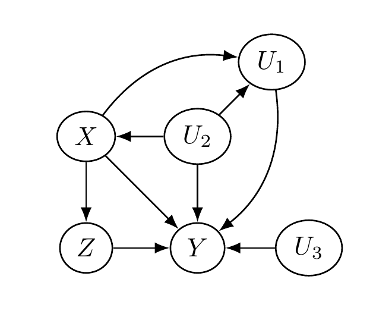
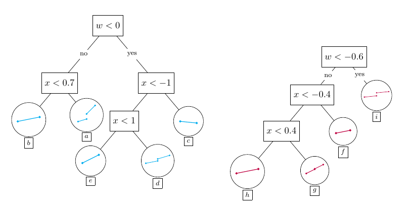
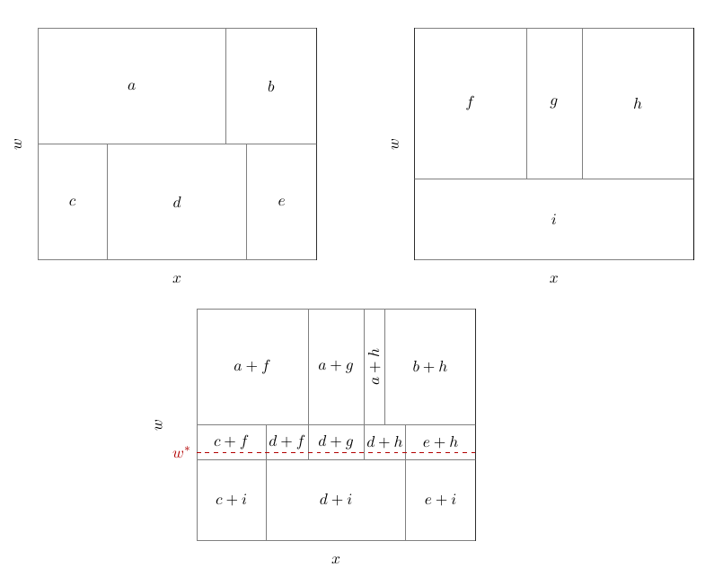

```{r setup, include=FALSE}
knitr::opts_chunk$set(echo = TRUE)
```

\usepackage{amsmath,asfonts,amssymb,amsthm}
\newcommand{\ind}{\perp \!\!\! \perp}
\newcommand{\B}{\mathcal{B}}
\newcommand{\res}{\mathbf{r}}
\newcommand{\m}{\mathbf{m}}
\newcommand{\x}{\mathbf{x}}
\newcommand{\C}{\mathbb{C}}
\newcommand{\N}{\mathrm{N}}
\newcommand{\w}{\mathrm{w}}
\newcommand{\iidsim}[0]{\stackrel{\mathrm{iid}}{\sim}}
\newcommand{\V}{ \mathbb{V}}
\newcommand{\f}{\mathrm{f}}
\newcommand{\F}{\mathbf{F}}
\newcommand{\Y}{\mathbf{Y}}

## Introduction

We study conditional average treatment effect (CATE) estimation for regression discontinuity designs (RDD), in which treatment assignment is based on whether a particular covariate --- referred to as the running variable --- lies above or below a known value, referred to as the cutoff value. Because treatment is deterministically assigned as a known function of the running variable,  RDDs are trivially deconfounded: treatment assignment is independent of the outcome variable, given the running variable (because treatment is conditionally constant). However, estimation of treatment effects in RDDs is more complicated than simply controlling for the running variable, because doing so introduces a complete lack of overlap, which is the other key condition needed to justify regression adjustment for causal inference. Nonetheless, the CATE _at the cutoff_, $X=c$, may still be identified provided the conditional expectation $E[Y \mid X,W]$ is continuous at that point for _all_ $W=w$. We exploit this assumption with the leaf regression BART model implemented in Stochtree, which allows us to define an explicit prior on the CATE. We now describe the RDD setup and our model in more detail, and provide code to implement our approach.

## Regression Discontinuity Design

We conceptualize the treatment effect estimation problem via a quartet of random variables $(Y, X, Z, U)$. The variable $Y$ is the outcome variable; the variable $X$ is the running variable; the variable $Z$ is the treatment assignment indicator variable; and the variable $U$ represents additional, possibly unobserved, causal factors. What specifically makes this correspond to an RDD is that we stipulate that $Z = I(X > c)$, for cutoff $c$. We assume $c = 0$ without loss of generality.  
	 
The following figure depicts a causal diagram representing the assumed causal relationships between these variables.  Two key features of this diagram are one, that $X$ blocks the impact of $U$ on $Z$: in other words, $X$ satisfies the back-door criterion for learning causal effects of $Z$ on $Y$. And two, $X$ and $U$ are not descendants of $Z$.

```{r cdag, echo=FALSE, fig.cap="A causal directed acyclic graph representing the general structure of a regression discontinuity design problem", fig.align="center", out.width = '40%'}

```

Using this causal diagram, we may express $Y$ as some function of its graph parents, the random variables $(X,Z,U)$: $$Y = F(X,Z,U).$$ In principle, we may obtain draws of $Y$ by first drawing $(X,Z,U)$ according to their joint distribution and then applying the function $F$. Similarly, we may relate this formulation to the potential outcomes framework straightforwardly:
\begin{equation}
\begin{split}
Y^1 &= F(X,1,U),\\
Y^0 &= F(X,0,U).
\end{split}
\end{equation}
Here, draws of $(Y^1, Y^0)$ may be obtained (in principle) by drawing $(X,Z,U)$ from their joint distribution and using only the $(X,U)$ elements as arguments in the above two equations, "discarding" the drawn value of $Z$. Note that this construction implies the _consistency_ condition: $Y = Y^1 Z + Y^0 ( 1 - Z)$. Likewise, this construction implies the _no interference_ condition because each $Y_i$ is considered to be produced with arguments ($X_i, Z_i, U_i)$ and not those from other units $j$; in particular, in constructing $Y_i$, $F$ does not take $Z_j$ for $j \neq i$ as an argument.

Next, we define the following conditional expectations
\begin{equation}
\begin{split}
\mu_1(x) &= E[ F(x, 1, U) \mid X = x] ,\\
\mu_0(x) &= E[ F(x, 0, U) \mid X = x],
\end{split}
\end{equation}
with which we can define the treatment effect function
$$\tau(x) = \mu_1(x) - \mu_0(x).$$
Because $X$ satisfies the back-door criterion, $\mu_1$ and $\mu_0$ are estimable from the data, meaning that 
\begin{equation}
\begin{split}
\mu_1(x) &= E[ F(x, 1, U) \mid X = x] = E[Y \mid X=x, Z=1],\\
\mu_0(x) &= E[ F(x, 0, U) \mid X = x] = E[Y \mid X=x, Z=0],
\end{split}
\end{equation}	
the right-hand-sides of which can be estimated from sample data, which we supposed to be independent and identically distributed realizations of $(Y_i, X_i, Z_i)$ for $i = 1, \dots, n$. However, because $Z = I(X >0)$ we can in fact only learn $\mu_1(x)$ for $X > 0$ and $\mu_0(x)$ for $X < 0$. In potential outcomes terminology, conditioning on $X$ satisfies ignorability,
$$(Y^1, Y^0) \ind Z \mid X,$$
but not _strong ignorability_, because overlap is violated. Overlap would require that
$$0 < P(Z = 1 \mid X=x) < 1 \;\;\;\; \forall x,$$
which is clearly violated by the RDD assumption that $Z = I(X > 0)$. Consequently, the overall ATE, 
$\bar{\tau} = E(\tau(X)),$ is unidentified, and  we must content ourselves with estimating $\tau(0)$, the conditional average effect at the point $x = 0$, which we estimate as the difference between $\mu_1(0) - \mu_0(0)$. This is possible for continuous $X$ so long as one is willing to assume that $\mu_1(x)$ and $\mu_0(x)$ are both suitably smooth functions of $x$: any inferred discontinuity at $x = 0$ must therefore be attributable to treatment effect.

### Conditional average treatment effects in RDD

We are concerned with learning not only $\tau(0)$, the "RDD ATE" (e.g. the CATE at $x = 0$), but also RDD CATEs, $\tau(0, \w)$ for some covariate vector $\w$. Incorporating additional covariates in the above framework turns out to be straightforward, simply by defining $W = \varphi(U)$ to be an observable function of the (possibly unobservable) causal factors $U$. We may then define our potential outcome means as
\begin{equation}
\begin{split}
\mu_1(x,\w) &= E[ F(x, 1, U) \mid X = x, W = \w] = E[Y \mid X=x, W=\w, Z=1],\\
\mu_0(x,\w) &= E[ F(x, 0, U) \mid X = x, W = \w] = E[Y \mid X=x, W = \w, Z=0],
\end{split}
\end{equation}
and our treatment effect function as
$$\tau(x,\w) = \mu_1(x,\w) - \mu_0(x,\w).$$ We consider our data to be independent and identically distributed realizations $(Y_i, X_i, Z_i, W_i)$ for $i = 1, \dots, n$. Furthermore, we must assume that $\mu_1(x,\w)$ and $\mu_0(x,\w)$ are suitably smooth functions of $x$, {\em for every} $\w$; in other words, for each value of $\w$ the usual continuity-based identification assumptions must hold. 

With this framework and notation established, CATE estimation in RDDs boils down to estimation of condition expectation functions $E[Y \mid X=x, W=\w, Z=z]$, for which we turn to BART models.

## The BARDDT Model

We propose a BART model where the trees are allowed to split on $(x,\w)$ but where each leaf node parameter is a vector of regression coefficients tailored to the RDD context (rather than a scalar constant as in default BART). In one sense, such a model can be seen as implying distinct RDD ATE regressions for each subgroup determined by a given tree; however, this intuition is only heuristic, as the entire model is fit jointly as an ensemble of such trees. Instead, we motivate this model as a way to estimate the necessary conditional expectations via a parametrization where the conditional treatment effect function can be explicitly regularized, as follows.

Let $\psi$ denote the following basis vector:
\begin{equation}
\psi(x,z) = \begin{bmatrix}
1 & z x & (1-z) x & z
\end{bmatrix}.
\end{equation}
To generalize the original BART model, we define $g_j(x, \w, z)$ as a piecewise linear function as follows.  Let $b_j(x, \w)$ denote the node in the $j$th tree which contains the point $(x, \w)$; then the prediction function for tree $j$ is defined to be:
\begin{equation}
g_j(x, \w, z) = \psi(x, z) \Gamma_{b_j(x, \w)}
\end{equation}	
for a leaf-specific regression vector $\Gamma_{b_j} = (\eta_{b_j}, \lambda_{b_j}, \theta_{b_j}, \Delta_{b_j})^t$. Therefore, letting $n_{b_j}$ denote the number of data points allocated to node $b$ in the $j$th tree and $\Psi_{b_j}$ denote the $n_{b_j} \times 4$ matrix, with rows equal to $\psi(x,z)$ for all $(x_i,z_i) \in b_j$, the model for observations assigned to leaf $b_j$, can be expressed in matrix notation as:
\begin{equation}
\begin{split}
\Y_{b_j} \mid \Gamma_{b_j}, \sigma^2 &\sim \N(\Psi_{b_j} \Gamma_{b_j},\sigma^2)\\
\Gamma_{b_j} &\sim \N (0, \Sigma_0),
\end{split} \label{eq:leaf.regression}
\end{equation}
where we set $\Sigma_0 = \frac{0.033}{J} \mbox{I}$ as a default (for $x$ vectors standardized to have unit variance in-sample). 
	
This choice of basis entails that the RDD CATE at $\w$,  $\tau(0, \w)$, is a sum of the $\Delta_{b_j(0, \w)}$ elements across all trees $j = 1, \dots, J$:
\begin{equation}
\begin{split}
\tau(0, \w) &= E[Y^1 \mid X=0, W = \w] - E[Y^0 \mid X = 0, W = \w]\\
& =  E[Y \mid X=0, W = \w, Z = 1] - E[Y \mid X = 0, W = \w, Z = 0]\\
&=  \sum_{j = 1}^J g_j(0, \w, 1) -  \sum_{j = 1}^J g_j(0, \w, 0)\\
&= \sum_{j = 1}^J \psi(0, 1) \Gamma_{b_j(0, \w)}  - \sum_{j = 1}^J \psi(0, 0) \Gamma_{b_j(0, \w)} \\
& = \sum_{j = 1}^J  \Bigl( \psi(0, 1) - \psi(0, 0) \Bigr)  \Gamma_{b_j(0, \w)} \\
& = \sum_{j = 1}^J  \Bigl( (1,0,0,1) - (1,0,0,0)  \Bigr)  \Gamma_{b_j(0, \w)} \\
&= \sum_{j=1}^J \Delta_{b_j(0, \w)}.
\end{split}
\end{equation}
As a result, the priors on the $\Delta$ coefficients directly regularize the treatment effect. We set the tree and error variance priors as in the original BART model. 

The following figures provide a graphical depiction of how the BARDDT model fits a response surface and thereby estimates CATEs for distinct values of $\w$. For simplicity only two trees are used in the illustration, while in practice dozens or hundreds of trees may be used (in our simulations and empirical example, we use 150 trees). 

```{r trees1, echo=FALSE, fig.cap="Two regression trees with splits in x and a single scalar w. Node images depict the g(x,w,z) function (in x) defined by that node's coefficients. The vertical gap between the two line segments in a node that contain x=0 is that node's contribution to the CATE at X = 0. Note that only such nodes contribute for CATE prediction at x=0", fig.align="center", out.width = '70%'}

```

```{r trees2, echo=FALSE, fig.cap="The two top figures show the same two regression trees as in the preceding figure, now represented as a partition of the x-w plane. Labels in each partition correspond to the leaf nodes depicted in the previous picture. The bottom figure shows the partition of the x-w plane implied by the sum of the two trees; the red dashed line marks point W=w* and the combination of nodes that include this point", fig.align="center", out.width = '70%'}

```

```{r trees3, echo=FALSE, fig.cap="Left: The function fit at W = w* for the two trees shown in the previous two figures, shown superimposed. Right: The aggregated fit achieved by summing the contributes of two regression tree fits shown at left. The magnitude of the discontinuity at x = 0 (located at the dashed gray vertical line) represents the treatment effect at that point. Different values of w will produce distinct fits; for the two trees shown, there can be three distinct fits based on the value of w.", fig.align="center", out.width = '70%'}
knitr::include_graphics("trees3.png")
```

An interesting property of BARDDT can be seen in this small illustration --- by letting the regression trees split on the running variable, there is no need to separately define a 'bandwidth' as is used in the polynomial approach to RDD. Instead, the regression trees automatically determine (in the course of posterior sampling) when to 'prune' away regions away from the cutoff value. There are two notable features of this approach. One, different trees in the ensemble are effectively using different local bandwidths and these fits are then blended together. For example, in the bottom panel of the second figure, we obtain one bandwidth for the region $d+i$, and a different one for regions $a+g$ and $d+g$. Two, for cells in the tree partition that do not span the cutoff, the regression within that partition contains no causal contrasts --- all observations either have $Z = 1$ or $Z = 0$. For those cells, the treatment effect coefficient is ill-posed and in those cases the posterior sampling is effectively a draw from the prior; however, such draws correspond to points where the treatment effect is unidentified and none of these draws contribute to the estimation of $\tau(0, \w)$ --- for example, only nodes $a+g$, $d+g$, and $d+i$ provide any contribution. This implies that draws of $\Delta$ corresponding to nodes not predicting at $X=0$ will always be draws from the prior, which has some intuitive appeal.

## Demo

In this section, we provide code for implementing our model in `stochtree` on a popular RDD dataset.
First, let us load `stochtree` and all the necessary libraries for our posterior analysis.

```{r}
## Load libraries
library(stochtree)
library(rpart)
library(rpart.plot)
library(xtable)
library(foreach)
library(doParallel)
```

### Dataset

The data comes from @lindo2010ability, who analyze data on college students enrolled in a large Canadian university in order to evaluate the effectiveness of an academic probation policy. Students who present a grade point average (GPA) lower than a certain threshold at the end of each term are placed on academic probation and must improve their GPA in the subsequent term or else face suspension. We are interested in how being put on probation or not, $Z$, affects students' GPA, $Y$, at the end of the current term. The running variable, $X$, is the negative distance between a student's previous-term GPA and the probation threshold, so that students placed on probation ($Z = 1$) have a positive score and the cutoff is 0. Potential moderators, $W$, are:

* gender (`male`), 
* age upon entering university (`age_at_entry`)
* a dummy for being born in North America (`bpl_north_america`), 
* the number of credits taken in the first year (`totcredits_year1`)
* an indicator designating each of three campuses (`loc_campus` 1, 2 and 3), and
* high school GPA as a quantile w.r.t the university's incoming class (`hsgrade_pct`).

```{r}
## Load and organize data
data <- read.csv("https://raw.githubusercontent.com/rdpackages-replication/CIT_2024_CUP/refs/heads/main/CIT_2024_CUP_discrete.csv")
y <- data$nextGPA
x <- data$X
x <- x/sd(x) ## we always standardize X
w <- data[,4:11]
### Must define categorical features as ordered/unordered factors
w$totcredits_year1 <- factor(w$totcredits_year1,ordered=TRUE)
w$male <- factor(w$male,ordered=FALSE)
w$bpl_north_america <- factor(w$bpl_north_america,ordered=FALSE)
w$loc_campus1 <- factor(w$loc_campus1,ordered=FALSE)
w$loc_campus2 <- factor(w$loc_campus2,ordered=FALSE)
w$loc_campus3 <- factor(w$loc_campus3,ordered=FALSE)
c <- 0
n <- nrow(data)
z <- as.numeric(x>c)
h <- 0.1 ## window for prediction sample
test <- -h < x & x < h
ntest <- sum(test)
```

### Target estimand

Generically, our estimand is the CATE function at $x = 0$; i.e. $\tau(0, \w)$. The key practical question is which values of $\w$ to consider. Some values of $\w$ will not be well-represented near $x=0$ and so no estimation technique will be able to estimate those points effectively. As such, to focus on feasible points --- which will lead to interesting comparisons between methods --- we recommend restricting the evaluation points to the observed $\w_i$ such that $|x_i| \leq \delta$, for some $\delta > 0$.  In our example, we use $\delta = 0.1$ for a standardized $x$ variable. Therefore, our estimand of interest is a vector of treatment effects:
\begin{equation}
\tau(0, \w_i) \;\;\; \forall i \;\mbox{ such that }\; |x_i| \leq \delta.
\end{equation}

### Implementing BARDDT

In order to implement our model, we write the Psi vector, as defined before: `Psi <- cbind(z*x,(1-z)*x, z,rep(1,n))`. The training matrix for the model is `as.matrix(cbind(x,w))`, which we feed into the `stochtree::bart` function via the `X_train` parameter. The basis vector `Psi` is fed into the function via the `leaf_basis_train` parameter. The list object `barddt.mean.parmlist` defines options for the mean forest (a different list can be defined for a variance forest in the case of heteroscedastic BART, which we do not consider here). Importantly, in this list we define parameter `sigma2_leaf_init = diag(rep(0.1/150,4))`, which sets $\Sigma_0$ as described above. Now, we can fit the model, which is saved in object `barddt.fit`.

Once the model is fit, we need 3 elements to obtain the CATE predictions: the basis vectors at the cutoff for $z=1$ and $z=0$, the test matrix $[X \quad W]$ at the cutoff, and the testing sample. We define the prediction basis vectors $\psi_1 = [1 \quad 0 \quad 0 \quad 1]$ and $\psi_0 = [1 \quad 0 \quad 0 \quad 0]$, which correspond to $\psi$ at $(x=0,z=1)$, and $(x=0,z=0)$, respectively. These vectors are written into R as `Psi1 <- cbind(rep(1,n), rep(c,n), rep(0,n), rep(1,n))` and `Psi0 <- cbind(rep(1,n), rep(0,n), rep(c,n), rep(0,n))`. Then, we write the test matrix at $(x=0,\w)$ as `xmat_test <- as.matrix(cbind(rep(0,n),w)`. Finally, we must define the testing window. As discussed previously, our window is set such that $|x| \leq 0.1$, which can be set in R as `test <- -0.1 < x & x <0.1`.

Once all of these elements are set, we can obtain the outcome predictions at the cutoff by running `predict(barddt.fit, xmat_test, Psi1)` (resp. `predict(barddt.fit, xmat_test, Psi0)`). Each of these calls returns a list, from which we can extract element `y_hat` to obtain the posterior distribution for the outcome. In the code below, the treated and control outcome predictions are saved in the matrix objects `pred1` and `pred0`, respectively. Now, we can obtain draws from the CATE posterior by simply subtracting these matrices. The function below outlines how to perform each of these steps in R.

```{r}
fit.barddt <- function(y,x,w,z,test,c)
{
  ## Lists of parameters for the Stochtree BART function
  barddt.global.parmlist <- list(standardize=T,sample_sigma_global=TRUE,sigma2_global_init=0.1)
  barddt.mean.parmlist <- list(num_trees=50, min_samples_leaf=20, alpha=0.95, beta=2,
                               max_depth=20, sample_sigma2_leaf=FALSE, sigma2_leaf_init = diag(rep(0.1/150,4)))
  ## Set basis vector for leaf regressions
  Psi <- cbind(rep(1,n),z*x,(1-z)*x,z)
  ## Model fit
  barddt.fit = stochtree::bart(X_train= as.matrix(cbind(x,w)), y_train=y,
                               leaf_basis_train = Psi, mean_forest_params=barddt.mean.parmlist,
                               general_params=barddt.global.parmlist,
                               num_mcmc=1000,num_gfr=30)
  ## Define basis vectors and test matrix for outcome predictions at X=c
  Psi1 <- cbind(rep(1,n), rep(c,n), rep(0,n), rep(1,n))
  Psi0 <- cbind(rep(1,n), rep(0,n), rep(c,n), rep(0,n))
  Psi1 <- Psi1[test,]
  Psi0 <- Psi0[test,]
  xmat_test <- as.matrix(cbind(rep(0,n),w)[test,])
  ## Obtain outcome predictions
  pred1 <- predict(barddt.fit,xmat_test,Psi1)$y_hat
  pred0 <- predict(barddt.fit,xmat_test,Psi0)$y_hat
  ## Obtain CATE posterior
  out <- pred1-pred0
  return(out)
}
```

Now, we proceed to fit the BARDDT model. The procedure is exactly the same as described in the simulation section.

```{r empiricalPosterior, cache=TRUE,cache.lazy=FALSE}
## We will sample multiple chains sequentially
num_chains <- 20
num_gfr <- 2
num_burnin <- 0
num_mcmc <- 500
bart_models <- list()
## Define basis functions for training and testing
B <- cbind(z*x,(1-z)*x, z,rep(1,n))
B1 <- cbind(rep(c,n), rep(0,n), rep(1,n), rep(1,n))
B0 <- cbind(rep(0,n), rep(c,n), rep(0,n), rep(1,n))
B1 <- B1[test,]
B0 <- B0[test,]
B_test <- rbind(B1,B0)
xmat_test <- cbind(x=rep(0,n),w)[test,]
xmat_test <- rbind(xmat_test,xmat_test)
### We combine the basis for Z=1 and Z=0 to feed it to the BART call and get the Y(z) predictions instantaneously
### Then we separate the posterior matrix between each Z and calculate the CATE prediction
## Sampling trees in parallel
ncores <- 5
cl <- makeCluster(ncores)
registerDoParallel(cl)

start_time <- Sys.time()
bart_model_outputs <- foreach (i = 1:num_chains) %dopar% {
  random_seed <- i
  ## Lists to define BARDDT parameters
  barddt.global.parmlist <- list(standardize=T,sample_sigma_global=TRUE,sigma2_global_init=0.1)
  barddt.mean.parmlist <- list(num_trees=50, min_samples_leaf=20, alpha=0.95, beta=2,
                               max_depth=20, sample_sigma2_leaf=FALSE, sigma2_leaf_init = diag(rep(0.1/50,4)))
  bart_model <- stochtree::bart(
    X_train = cbind(x,w), leaf_basis_train = B, y_train = y, 
    X_test = xmat_test, leaf_basis_test = B_test,
    num_gfr = num_gfr, num_burnin = num_burnin, num_mcmc = num_mcmc, 
    general_params = barddt.global.parmlist, mean_forest_params = barddt.mean.parmlist
  )
  bart_model <- bart_model$y_hat_test[1:ntest,]-bart_model$y_hat_test[(ntest+1):(2*ntest),]
}
stopCluster(cl)
## Combine CATE predictions
pred <- do.call("cbind",bart_model_outputs)

end_time <- Sys.time()

print(end_time - start_time)
## Save the results
saveRDS(pred, "bart_rdd_posterior.rds")
```

We now proceed to analyze the CATE posterior. The figure produced below presents a summary of the CATE posterior produced by BARDDT for this application. This picture is produced fitting a regression tree, using $W$ as the predictors, to the individual posterior mean CATEs:
\begin{equation}
\bar{\tau}_i =  \frac{1}{M} \sum_{h = 1}^M \tau^{(h)}(0, \w_i),
\end{equation}
where $h$ indexes each of $M$ total posterior samples. As in our simulation studies, we restrict our posterior analysis to use $\w_i$ values of observations with $|x_i| \leq \delta = 0.1$ (after normalizing $X$ to have standard deviation 1 in-sample). For the @lindo2010ability data, this means that BARDDT was trained on $n = 40,582$ observations, of which 1,602 satisfy $x_i \leq 0.1$, which were used to generate the effect moderation tree.

```{r cart_summary, fig.cap="Regression tree fit to posterior point estimates of individual treatment effects: top number in each box is the average subgroup treatment effect, lower number shows the percentage of the total sample in that subgroup; the tree flags credits in first year, gender, and age at entry as important moderators.", fig.align="center"}
## Fit regression tree
cate <- rpart(y~.,data.frame(y=rowMeans(pred),w[test,]),control = rpart.control(cp=0.015))
## Define separate colors for left and rightmost nodes
plot.cart <- function(rpart.obj)
{
  rpart.frame <- rpart.obj$frame
  left <- which.min(rpart.frame$yval)
  right <- which.max(rpart.frame$yval)
  nodes <- rep(NA,nrow(rpart.frame))
  for (i in 1:length(nodes))
  {
    if (rpart.frame$yval[i]==rpart.frame$yval[right]) nodes[i] <- "gold2"
    else if (rpart.frame$yval[i]==rpart.frame$yval[left]) nodes[i] <- "tomato3"
    else nodes[i] <- "lightblue3"
  }
  return(nodes)
}
## Plot regression tree
rpart.plot(cate,main="",box.col=plot.cart(cate))
```

The resulting effect moderation tree indicates that course load (credits attempted) in the academic term leading to their probation is a strong moderator. Contextually, this result is plausible, both because course load could relate to latent character attributes that influence a student's responsiveness to sanctions and also because it could predict course load in the current term, which would in turn have implications for the GPA (i.e. it is harder to get a high GPA while taking more credit hours).  The tree also suggests that effects differ by campus, and age and gender of the student. These findings are all prima facie plausible as well.

To gauge how strong these findings are statistically, we can zoom in on isolated subgroups and compare the posteriors of their subgroup average treatment effects. This approach is valid because in fitting the effect moderation tree to the posterior mean CATEs we in no way altered the posterior itself; the effect moderation tree is a posterior summary tool and not any additional inferential approach; the posterior is obtained once and can be explored freely using a variety of techniques without vitiating its statistical validity. Investigating the most extreme differences is a good place to start: consider the two groups of students at opposite ends of the treatment effect range discovered by the effect moderation tree:	

* **Group A** a male student that entered college older than 19 and attempted more than 4.8 credits in the first year (leftmost leaf node, colored red,  comprising 128 individuals)
* **Group B** a student of any gender who entered college younger than 19 and attempted between 4.3 and 4.8 credits in the first year (rightmost leaf node, colored gold, comprising 108 individuals).

Subgroup CATEs are obtained by aggregating CATEs across the observed $\w_i$ values for individuals in each group; this can be done for individual posterior samples, yielding a posterior distribution over the subgroup CATE:
\begin{equation}
\bar{\tau}_A^{(h)} = \frac{1}{n_A} \sum_{i : \w_i} \tau^{(h)}(0, \w_i),
\end{equation}
where $h$ indexes a posterior draw and $n_A$ denotes the number of individuals in the group A.

The code below produces a contour plot for a bivariate kernel density estimate of the joint CATE posterior distribution for subgroups A and B. The contour lines are nearly all above the $45^{\circ}$ line, indicating that the preponderance of posterior probability falls in the region where the treatment effect for Group B is greater than that of Group A, meaning that the difference in the subgroup treatment effects flagged by the effect moderation tree persist even after accounting for estimation uncertainty in the underlying CATE function.

```{r kde, fig.cap="Kernel density estimates for the joint CATE posterior between male students who entered college older than 19 and attempted more than 4.8 credits in the first year (leftmost leaf node, red) and students who entered college younger than 19 and attempted between 4.3 and 4.8 credits in the first year (rightmost leaf node, gold)", fig.align="center"}
## Define function to produce KD estimates of the joint distribution of two subgroups
cate.kde <- function(rpart.obj,pred)
{
  rpart.frame <- rpart.obj$frame
  left <- rpart.obj$where==which.min(rpart.frame$yval)
  right <- rpart.obj$where==which.max(rpart.frame$yval)
  ## Calculate CATE posterior for groups A and B
  cate.a <- do.call("cbind",by(pred,left, colMeans))
  cate.b <- do.call("cbind",by(pred,right, colMeans))
  cate.a <- cate.a[,2]
  cate.b <- cate.b[,2]
  ## Estimate kernel density
  denshat <- MASS::kde2d(cate.a, cate.b, n=200)
  return(denshat)
}
contour(cate.kde(cate,pred),bty='n',xlab="Group A",ylab="Group B")
abline(a=0,b=1)
```

As always, CATEs that vary with observable factors do not necessarily represent a _causal_ moderating relationship. Here, if the treatment effect of academic probation is seen to vary with the number of credits, that does not imply that this association is causal: prescribing students to take a certain number of credits will not necessarily lead to a more effective probation policy, it may simply be that the type of student to naturally enroll for fewer credit hours is more likely to be responsive to academic probation. An entirely distinct set of causal assumptions are required to interpret the CATE variations themselves as causal. All the same, uncovering these patterns of treatment effect variability are crucial to suggesting causal mechanism to be investigated in future studies.

# References


