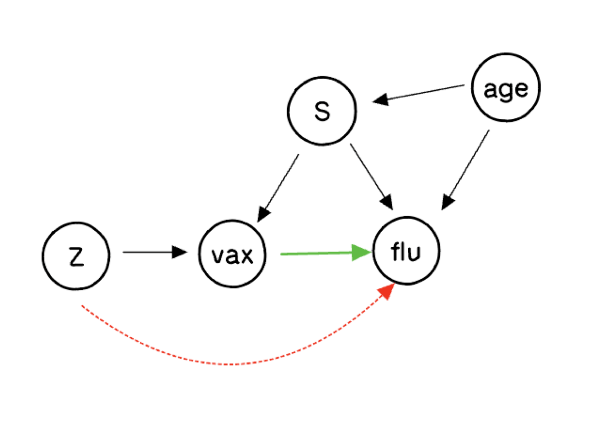

## Introduction

Here we consider a causal inference problem with a binary treatment and a binary outcome
where there is unobserved confounding, but an exogenous instrument is available (also
binary). This problem requires several extensions to the basic BART model, all of which
can be implemented as Gibbs samplers using `stochtree`. Our analysis follows the
Bayesian nonparametric approach described in the supplement to @hahn2016bayesian.

## Background

To be concrete, suppose we wish to measure the effect of receiving a flu vaccine on the
probability of getting the flu. Individuals who opt to get a flu shot differ in many
ways from those that don't, and these lifestyle differences presumably also affect their
respective chances of getting the flu. However, a randomized encouragement design —
where some individuals are selected at random to receive extra incentive to get a flu
shot — allows us to tease apart the impact of the vaccine from the confounding factors.
This exact problem has been studied in @mcdonald1992effects, with follow-on analyses by
@hirano2000assessing, @richardson2011transparent, and @imbens2015causal.

## Notation

Let $V$ denote the treatment variable (vaccine). Let $Y$ denote the response
(getting the flu), $Z$ the instrument (encouragement), and $X$ an additional observable
covariate (patient age).

Let $S$ denote the *principal strata*, an exhaustive characterization of how individuals
are affected by the encouragement. Some people will get a flu shot no matter what:
*always takers* ($a$). Some will not get the shot no matter what: *never takers* ($n$).
*Compliers* ($c$) would not have gotten the shot but for the encouragement. We assume
no *defiers* ($d$).

## The Causal Diagram

{width=50% fig-align="center"}

The biggest question about this graph concerns the dashed red arrow from the putative
instrument $Z$ to the outcome. If that arrow is present, $Z$ is not a valid instrument.
The assumption that there is no such arrow is the *exclusion restriction*. We will
explore what inferences are possible when we remain agnostic about its presence.

## Potential Outcomes

There are six distinct random variables: $V(0)$, $V(1)$, $Y(0,0)$, $Y(1,0)$, $Y(0,1)$,
and $Y(1,1)$. The fundamental problem of causal inference is that some of these are
never simultaneously observed:

| $i$ | $Z_i$ | $V_i(0)$ | $V_i(1)$ | $Y_i(0,0)$ | $Y_i(1,0)$ | $Y_i(0,1)$ | $Y_i(1,1)$ |
|:---:|:---:|:---:|:---:|:---:|:---:|:---:|:---:|
| 1 | 1 | ? | 1 | ? | ? | ? | 0 |
| 2 | 0 | 1 | ? | ? | 1 | ? | ? |
| 3 | 0 | 0 | ? | 1 | ? | ? | ? |
| 4 | 1 | ? | 0 | ? | ? | 0 | ? |
| $\vdots$ | $\vdots$ | $\vdots$ | $\vdots$ | $\vdots$ | $\vdots$ | $\vdots$ | $\vdots$ |

The principal strata are defined by which potential treatment $V(z)$ is observed:

| $V_i(0)$ | $V_i(1)$ | $S_i$ |
|:---:|:---:|:---:|
| 0 | 0 | Never Taker ($n$) |
| 1 | 1 | Always Taker ($a$) |
| 0 | 1 | Complier ($c$) |
| 1 | 0 | Defier ($d$) |

## Estimands and Identification

Let $\pi_s(x) = \Pr(S=s \mid X=x)$ and
$\gamma_s^{vz}(x) = \Pr(Y(v,z)=1 \mid S=s, X=x)$.
The complier conditional average treatment effect
$\gamma_c^{1,z}(x) - \gamma_c^{0,z}(x)$ is our ultimate goal.

Under the monotonicity assumption ($\pi_d(x) = 0$), the observed data imply:

$$
\begin{aligned}
p_{1 \mid 00}(x) &= \frac{\pi_c(x)}{\pi_c(x)+\pi_n(x)} \gamma_c^{00}(x)
  + \frac{\pi_n(x)}{\pi_c(x)+\pi_n(x)} \gamma_n^{00}(x) \\
p_{1 \mid 11}(x) &= \frac{\pi_c(x)}{\pi_c(x)+\pi_a(x)} \gamma_c^{11}(x)
  + \frac{\pi_a(x)}{\pi_c(x)+\pi_a(x)} \gamma_a^{11}(x) \\
p_{1 \mid 01}(x) &= \gamma_n^{01}(x) \\
p_{1 \mid 10}(x) &= \gamma_a^{10}(x)
\end{aligned}
$$

and the strata probabilities satisfy:

$$
\Pr(V=1 \mid Z=0, X=x) = \pi_a(x), \qquad
\Pr(V=1 \mid Z=1, X=x) = \pi_a(x) + \pi_c(x).
$$

Under the exclusion restriction, $\gamma_c^{11}(x)$ and $\gamma_c^{00}(x)$ are
point-identified. Without it, they are partially identified:

$$
\max\!\left(0,\, \frac{\pi_c+\pi_n}{\pi_c} p_{1\mid 00} - \frac{\pi_n}{\pi_c}\right)
\leq \gamma_c^{00}(x) \leq
\min\!\left(1,\, \frac{\pi_c+\pi_n}{\pi_c} p_{1\mid 00}\right),
$$

and analogously for $\gamma_c^{11}(x)$.

## Load Libraries

:::{.panel-tabset group="language"}

## R

```{r}
#| include: false
reticulate::use_python(
  Sys.getenv("RETICULATE_PYTHON", unset = Sys.which("python3")),
  required = TRUE
)
```

```{r}
#| message: false
library(stochtree)
```

## Python

```{python}
import numpy as np
import matplotlib.pyplot as plt
from scipy.stats import norm

from stochtree import (
    RNG, Dataset, Forest, ForestContainer,
    ForestSampler, Residual, ForestModelConfig, GlobalModelConfig,
)
```

:::

## Simulate the Data

### Setup

:::{.panel-tabset group="language"}

## R

```{r}
n <- 20000
random_seed <- NULL
```

## Python

```{python}
n = 20000
random_seed = None
if random_seed is not None:
    rng = np.random.default_rng(random_seed)
else:
    rng = np.random.default_rng()
```

:::

### Generate the Instrument

:::{.panel-tabset group="language"}

## R

```{r}
z <- rbinom(n, 1, 0.5)
```

## Python

```{python}
z = rng.binomial(n=1, p=0.5, size=n)
```

:::

### Generate the Covariate

We think of $X$ as patient age, drawn from a uniform distribution on $[0, 3]$
(pre-standardized for illustration purposes).

:::{.panel-tabset group="language"}

## R

```{r}
p_X <- 1
X   <- matrix(runif(n * p_X, 0, 3), ncol = p_X)
x   <- X[, 1]
```

## Python

```{python}
p_X = 1
X   = rng.uniform(low=0., high=3., size=(n, p_X))
x   = X[:, 0]
```

:::

### Generate the Principal Strata

We generate $S$ from a logistic model in $X$, parameterized so that the probability
of being a never taker decreases with age.

:::{.panel-tabset group="language"}

## R

```{r}
alpha_a <- 0;  beta_a <- 1
alpha_n <- 1;  beta_n <- -1
alpha_c <- 1;  beta_c <- 1

pi_s <- function(xval) {
  w_a <- exp(alpha_a + beta_a * xval)
  w_n <- exp(alpha_n + beta_n * xval)
  w_c <- exp(alpha_c + beta_c * xval)
  w   <- cbind(w_a, w_n, w_c)
  w / rowSums(w)
}

s <- sapply(seq_len(n), function(j)
  sample(c("a", "n", "c"), 1, prob = pi_s(X[j, 1])))
```

## Python

```{python}
alpha_a = 0;  beta_a = 1
alpha_n = 1;  beta_n = -1
alpha_c = 1;  beta_c = 1

def pi_s(xval, alpha_a, beta_a, alpha_n, beta_n, alpha_c, beta_c):
    w = np.column_stack([
        np.exp(alpha_a + beta_a * xval),
        np.exp(alpha_n + beta_n * xval),
        np.exp(alpha_c + beta_c * xval),
    ])
    return w / w.sum(axis=1, keepdims=True)

strata_probs = pi_s(X[:, 0], alpha_a, beta_a, alpha_n, beta_n, alpha_c, beta_c)
s = np.empty(n, dtype=str)
for i in range(n):
    s[i] = rng.choice(['a', 'n', 'c'], p=strata_probs[i, :])
```

:::

### Generate the Treatment

The treatment $V$ is a deterministic function of $S$ and $Z$ — this is what gives the
principal strata their meaning.

:::{.panel-tabset group="language"}

## R

```{r}
v <- 1*(s == "a") + 0*(s == "n") + z*(s == "c") + (1-z)*(s == "d")
```

## Python

```{python}
v = 1*(s == 'a') + 0*(s == 'n') + z*(s == "c") + (1-z)*(s == "d")
```

:::

### Generate the Outcome

The outcome structural model — by varying this function we can alter the
identification conditions. Setting it to depend on `zval` violates the exclusion
restriction, and we do so here to illustrate partial identification.

:::{.panel-tabset group="language"}

## R

```{r}
gamfun <- function(xval, vval, zval, sval) {
  baseline <- pnorm(2 - xval - 2.5*(xval - 1.5)^2 - 0.5*zval
                    + 1*(sval == "n") - 1*(sval == "a"))
  baseline - 0.5 * vval * baseline
}
y <- rbinom(n, 1, gamfun(X[, 1], v, z, s))
```

## Python

```{python}
def gamfun(xval, vval, zval, sval):
    baseline = norm.cdf(2 - xval - 2.5*(xval - 1.5)**2 - 0.5*zval
                        + 1*(sval == "n") - 1*(sval == "a"))
    return baseline - 0.5 * vval * baseline

y = rng.binomial(n=1, p=gamfun(X[:, 0], v, z, s), size=n)
```

:::

### Organize the Data

For the monotone probit model, the observations must be sorted so that $Z=1$ cases
come first.

:::{.panel-tabset group="language"}

## R

```{r}
Xall  <- cbind(X, v, z)
p_X   <- p_X + 2
index <- sort(z, decreasing = TRUE, index.return = TRUE)
X     <- matrix(X[index$ix, ], ncol = 1)
Xall  <- Xall[index$ix, ]
z     <- z[index$ix]
v     <- v[index$ix]
s     <- s[index$ix]
y     <- y[index$ix]
x     <- x[index$ix]
```

## Python

```{python}
Xall       = np.concatenate((X, np.column_stack((v, z))), axis=1)
p_X        = p_X + 2
sort_index = np.argsort(z)[::-1]
X          = X[sort_index, :]
Xall       = Xall[sort_index, :]
z          = z[sort_index]
v          = v[sort_index]
s          = s[sort_index]
y          = y[sort_index]
x          = x[sort_index]
```

:::

## Fit the Outcome Model

We fit a probit BART model for $\Pr(Y=1 \mid V=1, Z=1, X=x)$ using the
Albert–Chib [@albert1993bayesian] data augmentation Gibbs sampler. We initialize the
forest, enter the main loop (alternating: sample forest | sample latent utilities),
and retain all post-warmstart draws.

:::{.panel-tabset group="language"}

## R

```{r}
#| cache: true
num_warmstart <- 10
num_mcmc      <- 1000
num_samples   <- num_warmstart + num_mcmc

alpha <- 0.95;  beta <- 2;  min_samples_leaf <- 1;  max_depth <- 20
num_trees <- 50;  cutpoint_grid_size <- 100
tau_init  <- 0.5
leaf_prior_scale <- matrix(tau_init, ncol = 1)
feature_types <- as.integer(c(rep(0, p_X - 2), 1, 1))
var_weights   <- rep(1, p_X) / p_X
outcome_model_type <- 0

if (is.null(random_seed)) {
  rng_r <- createCppRNG(-1)
} else {
  rng_r <- createCppRNG(random_seed)
}

forest_dataset <- createForestDataset(Xall)
forest_model_config <- createForestModelConfig(
  feature_types = feature_types, num_trees = num_trees,
  num_features = p_X, num_observations = n,
  variable_weights = var_weights, leaf_dimension = 1,
  alpha = alpha, beta = beta, min_samples_leaf = min_samples_leaf,
  max_depth = max_depth, leaf_model_type = outcome_model_type,
  leaf_model_scale = leaf_prior_scale,
  cutpoint_grid_size = cutpoint_grid_size
)
global_model_config <- createGlobalModelConfig(global_error_variance = 1)
forest_model    <- createForestModel(forest_dataset, forest_model_config,
                                     global_model_config)
forest_samples  <- createForestSamples(num_trees, 1, TRUE, FALSE)
active_forest   <- createForest(num_trees, 1, TRUE, FALSE)

n1  <- sum(y)
zed <- 0.25 * (2 * as.numeric(y) - 1)
outcome <- createOutcome(zed)
active_forest$prepare_for_sampler(forest_dataset, outcome, forest_model,
                                   outcome_model_type, 0.0)
active_forest$adjust_residual(forest_dataset, outcome, forest_model,
                               FALSE, FALSE)

gfr_flag <- TRUE
for (i in seq_len(num_samples)) {
  if (i > num_warmstart) gfr_flag <- FALSE
  forest_model$sample_one_iteration(
    forest_dataset, outcome, forest_samples, active_forest,
    rng_r, forest_model_config, global_model_config,
    keep_forest = TRUE, gfr = gfr_flag
  )
  eta <- forest_samples$predict_raw_single_forest(forest_dataset, i - 1)
  U1  <- runif(n1, pnorm(0, eta[y == 1], 1), 1)
  zed[y == 1] <- qnorm(U1, eta[y == 1], 1)
  U0  <- runif(n - n1, 0, pnorm(0, eta[y == 0], 1))
  zed[y == 0] <- qnorm(U0, eta[y == 0], 1)
  outcome$update_data(zed)
  forest_model$propagate_residual_update(outcome)
}
```

## Python

```{python}
#| cache: true
num_warmstart <- 10
num_mcmc      <- 1000
num_samples   = num_warmstart + num_mcmc

alpha = 0.95;  beta = 2;  min_samples_leaf = 1;  max_depth = 20
num_trees = 50;  cutpoint_grid_size = 100
tau_init  = 0.5
leaf_prior_scale  = np.array([[tau_init]])
feature_types = np.append(np.repeat(0, p_X - 2), [1, 1]).astype(int)
var_weights   = np.repeat(1.0 / p_X, p_X)
outcome_model_type = 0

cpp_rng = RNG(random_seed) if random_seed is not None else RNG()

forest_dataset = Dataset()
forest_dataset.add_covariates(Xall)

forest_model_config = ForestModelConfig(
    feature_types=feature_types, num_trees=num_trees,
    num_features=p_X, num_observations=n,
    variable_weights=var_weights, leaf_dimension=1,
    alpha=alpha, beta=beta, min_samples_leaf=min_samples_leaf,
    max_depth=max_depth, leaf_model_type=outcome_model_type,
    leaf_model_scale=leaf_prior_scale,
    cutpoint_grid_size=cutpoint_grid_size,
)
global_model_config = GlobalModelConfig(global_error_variance=1.0)
forest_sampler = ForestSampler(forest_dataset, global_model_config,
                                forest_model_config)
forest_samples = ForestContainer(num_trees, 1, True, False)
active_forest  = Forest(num_trees, 1, True, False)

n1  = int(np.sum(y))
zed = 0.25 * (2.0 * y - 1.0)
outcome = Residual(zed)
forest_sampler.prepare_for_sampler(forest_dataset, outcome, active_forest,
                                    outcome_model_type, np.array([0.0]))

gfr_flag = True
for i in range(num_samples):
    if i >= num_warmstart:
        gfr_flag = False
    forest_sampler.sample_one_iteration(
        forest_samples, active_forest, forest_dataset, outcome, cpp_rng,
        global_model_config, forest_model_config,
        keep_forest=True, gfr=gfr_flag,
    )
    eta  = np.squeeze(forest_samples.predict_raw_single_forest(forest_dataset, i))
    mu0  = eta[y == 0];  mu1 = eta[y == 1]
    u0   = rng.uniform(0, norm.cdf(-mu0), size=n - n1)
    u1   = rng.uniform(norm.cdf(-mu1), 1, size=n1)
    zed[y == 0] = mu0 + norm.ppf(u0)
    zed[y == 1] = mu1 + norm.ppf(u1)
    outcome.update_data(np.squeeze(zed) - eta)
```

:::

## Fit the Monotone Probit Model

The monotonicity constraint
$\Pr(V=1 \mid Z=0, X=x) \leq \Pr(V=1 \mid Z=1, X=x)$ is enforced via the
data augmentation of @papakostas2023forecasts. We parameterize:

$$
\Pr(V=1 \mid Z=0, X=x) = \Phi_f(x)\,\Phi_h(x), \qquad
\Pr(V=1 \mid Z=1, X=x) = \Phi_f(x),
$$

where $\Phi_\mu(x)$ is the normal CDF with mean $\mu(x)$ and variance 1.

:::{.panel-tabset group="language"}

## R

```{r}
#| cache: true
X_h  <- as.matrix(X[z == 0, ])
n0   <- sum(z == 0);  n1 <- sum(z == 1)
num_trees_f <- 50;  num_trees_h <- 20
feature_types_mono <- as.integer(rep(0, 1))
var_weights_mono   <- rep(1, 1)
tau_h <- 1 / num_trees_h
leaf_scale_h <- matrix(tau_h, ncol = 1)
leaf_scale_f <- matrix(1 / num_trees_f, ncol = 1)

forest_dataset_f <- createForestDataset(X)
forest_dataset_h <- createForestDataset(X_h)

fmc_f <- createForestModelConfig(
  feature_types = feature_types_mono, num_trees = num_trees_f,
  num_features = ncol(X), num_observations = nrow(X),
  variable_weights = var_weights_mono, leaf_dimension = 1,
  alpha = alpha, beta = beta, min_samples_leaf = min_samples_leaf,
  max_depth = max_depth, leaf_model_type = 0,
  leaf_model_scale = leaf_scale_f, cutpoint_grid_size = cutpoint_grid_size
)
fmc_h <- createForestModelConfig(
  feature_types = feature_types_mono, num_trees = num_trees_h,
  num_features = ncol(X_h), num_observations = nrow(X_h),
  variable_weights = var_weights_mono, leaf_dimension = 1,
  alpha = alpha, beta = beta, min_samples_leaf = min_samples_leaf,
  max_depth = max_depth, leaf_model_type = 0,
  leaf_model_scale = leaf_scale_h, cutpoint_grid_size = cutpoint_grid_size
)
gmc_mono <- createGlobalModelConfig(global_error_variance = 1)
fm_f <- createForestModel(forest_dataset_f, fmc_f, gmc_mono)
fm_h <- createForestModel(forest_dataset_h, fmc_h, gmc_mono)

fs_f <- createForestSamples(num_trees_f, 1, TRUE)
fs_h <- createForestSamples(num_trees_h, 1, TRUE)
af_f <- createForest(num_trees_f, 1, TRUE)
af_h <- createForest(num_trees_h, 1, TRUE)

v1 <- v[z == 1];  v0 <- v[z == 0]
R1 <- rep(NA, n0);  R0 <- rep(NA, n0)
R1[v0 == 1] <- 1;   R0[v0 == 1] <- 1
R1[v0 == 0] <- 0;   R0[v0 == 0] <- sample(c(0, 1), sum(v0 == 0), replace = TRUE)
vaug <- c(v1, R1)

z_f <- (2 * as.numeric(vaug) - 1);  z_f <- z_f / sd(z_f)
z_h <- (2 * as.numeric(R0)  - 1);   z_h <- z_h / sd(z_h)
out_f <- createOutcome(z_f);  out_h <- createOutcome(z_h)
af_f$prepare_for_sampler(forest_dataset_f, out_f, fm_f, 0, 0.0)
af_h$prepare_for_sampler(forest_dataset_h, out_h, fm_h, 0, 0.0)
af_f$adjust_residual(forest_dataset_f, out_f, fm_f, FALSE, FALSE)
af_h$adjust_residual(forest_dataset_h, out_h, fm_h, FALSE, FALSE)

gfr_flag <- TRUE
for (i in seq_len(num_samples)) {
  if (i > num_warmstart) gfr_flag <- FALSE
  fm_f$sample_one_iteration(forest_dataset_f, out_f, fs_f, af_f,
    rng_r, fmc_f, gmc_mono, keep_forest = TRUE, gfr = gfr_flag)
  fm_h$sample_one_iteration(forest_dataset_h, out_h, fs_h, af_h,
    rng_r, fmc_h, gmc_mono, keep_forest = TRUE, gfr = gfr_flag)

  eta_f <- forest_samples_f$predict_raw_single_forest(forest_dataset_f, i - 1)
  eta_h <- forest_samples_h$predict_raw_single_forest(forest_dataset_h, i - 1)

  idx0  <- which(v0 == 0)
  w1 <- (1 - pnorm(eta_h[idx0])) * (1 - pnorm(eta_f[n1 + idx0]))
  w2 <- (1 - pnorm(eta_h[idx0])) *      pnorm(eta_f[n1 + idx0])
  w3 <-      pnorm(eta_h[idx0])  * (1 - pnorm(eta_f[n1 + idx0]))
  s_w <- w1 + w2 + w3
  u   <- runif(length(idx0))
  temp <- 1*(u < w1/s_w) + 2*(u > w1/s_w & u < (w1+w2)/s_w) + 3*(u > (w1+w2)/s_w)
  R1[v0 == 0] <- 1*(temp == 2);  R0[v0 == 0] <- 1*(temp == 3)
  vaug <- c(v1, R1)

  U1 <- runif(sum(R0),    pnorm(0, eta_h[R0 == 1], 1), 1)
  z_h[R0 == 1] <- qnorm(U1, eta_h[R0 == 1], 1)
  U0 <- runif(n0 - sum(R0), 0, pnorm(0, eta_h[R0 == 0], 1))
  z_h[R0 == 0] <- qnorm(U0, eta_h[R0 == 0], 1)

  U1 <- runif(sum(vaug),    pnorm(0, eta_f[vaug == 1], 1), 1)
  z_f[vaug == 1] <- qnorm(U1, eta_f[vaug == 1], 1)
  U0 <- runif(n - sum(vaug), 0, pnorm(0, eta_f[vaug == 0], 1))
  z_f[vaug == 0] <- qnorm(U0, eta_f[vaug == 0], 1)

  out_h$update_data(z_h);  fm_h$propagate_residual_update(out_h)
  out_f$update_data(z_f);  fm_f$propagate_residual_update(out_f)
}
```

## Python

```{python}
#| cache: true
X_h  = X[z == 0, :]
n0   = int(np.sum(z == 0));  n1 = int(np.sum(z == 1))
num_trees_f = 50;  num_trees_h = 20
feature_types_mono = np.repeat(0, p_X - 2).astype(int)
var_weights_mono   = np.repeat(1.0 / (p_X - 2.0), p_X - 2)
leaf_scale_f = np.array([[1.0 / num_trees_f]])
leaf_scale_h = np.array([[1.0 / num_trees_h]])

forest_dataset_f = Dataset();  forest_dataset_f.add_covariates(X)
forest_dataset_h = Dataset();  forest_dataset_h.add_covariates(X_h)

fmc_f = ForestModelConfig(
    feature_types=feature_types_mono, num_trees=num_trees_f,
    num_features=X.shape[1], num_observations=n,
    variable_weights=var_weights_mono, leaf_dimension=1,
    alpha=alpha, beta=beta, min_samples_leaf=min_samples_leaf,
    max_depth=max_depth, leaf_model_type=0,
    leaf_model_scale=leaf_scale_f, cutpoint_grid_size=cutpoint_grid_size,
)
fmc_h = ForestModelConfig(
    feature_types=feature_types_mono, num_trees=num_trees_h,
    num_features=X_h.shape[1], num_observations=n0,
    variable_weights=var_weights_mono, leaf_dimension=1,
    alpha=alpha, beta=beta, min_samples_leaf=min_samples_leaf,
    max_depth=max_depth, leaf_model_type=0,
    leaf_model_scale=leaf_scale_h, cutpoint_grid_size=cutpoint_grid_size,
)
gmc_mono = GlobalModelConfig(global_error_variance=1.0)
fs_f = ForestSampler(forest_dataset_f, gmc_mono, fmc_f)
fs_h = ForestSampler(forest_dataset_h, gmc_mono, fmc_h)
forest_samples_f = ForestContainer(num_trees_f, 1, True, False)
forest_samples_h = ForestContainer(num_trees_h, 1, True, False)
af_f = Forest(num_trees_f, 1, True, False)
af_h = Forest(num_trees_h, 1, True, False)

v1 = v[z == 1];  v0 = v[z == 0]
R1 = np.empty(n0);  R0 = np.empty(n0)
R1[v0 == 1] = 1;    R0[v0 == 1] = 1
nv0 = int(np.sum(v0 == 0))
R1[v0 == 0] = 0;    R0[v0 == 0] = rng.choice([0, 1], size=nv0)
vaug = np.append(v1, R1)
z_f  = (2.0 * vaug - 1.0);  z_f = z_f / np.std(z_f)
z_h  = (2.0 * R0   - 1.0);  z_h = z_h / np.std(z_h)
out_f = Residual(z_f);  out_h = Residual(z_h)
fs_f.prepare_for_sampler(forest_dataset_f, out_f, af_f, 0, np.array([0.0]))
fs_h.prepare_for_sampler(forest_dataset_h, out_h, af_h, 0, np.array([0.0]))

gfr_flag = True
for i in range(num_samples):
    if i >= num_warmstart:
        gfr_flag = False
    fs_f.sample_one_iteration(forest_samples_f, af_f, forest_dataset_f, out_f,
        cpp_rng, gmc_mono, fmc_f, keep_forest=True, gfr=gfr_flag)
    fs_h.sample_one_iteration(forest_samples_h, af_h, forest_dataset_h, out_h,
        cpp_rng, gmc_mono, fmc_h, keep_forest=True, gfr=gfr_flag)

    eta_f = np.squeeze(forest_samples_f.predict_raw_single_forest(forest_dataset_f, i))
    eta_h = np.squeeze(forest_samples_h.predict_raw_single_forest(forest_dataset_h, i))

    idx0 = np.where(v0 == 0)[0]
    w1 = (1 - norm.cdf(eta_h[idx0])) * (1 - norm.cdf(eta_f[n1 + idx0]))
    w2 = (1 - norm.cdf(eta_h[idx0])) *      norm.cdf(eta_f[n1 + idx0])
    w3 =      norm.cdf(eta_h[idx0])  * (1 - norm.cdf(eta_f[n1 + idx0]))
    s_w = w1 + w2 + w3
    u   = rng.uniform(size=len(idx0))
    temp = 1*(u < w1/s_w) + 2*((u > w1/s_w) & (u < (w1+w2)/s_w)) + 3*(u > (w1+w2)/s_w)
    R1[v0 == 0] = (temp == 2).astype(float)
    R0[v0 == 0] = (temp == 3).astype(float)
    vaug = np.append(v1, R1)

    mu1 = eta_h[R0 == 1]
    z_h[R0 == 1] = mu1 + norm.ppf(rng.uniform(norm.cdf(-mu1), 1, size=int(np.sum(R0))))
    mu0 = eta_h[R0 == 0]
    z_h[R0 == 0] = mu0 + norm.ppf(rng.uniform(0, norm.cdf(-mu0), size=n0 - int(np.sum(R0))))

    mu1 = eta_f[vaug == 1]
    z_f[vaug == 1] = mu1 + norm.ppf(rng.uniform(norm.cdf(-mu1), 1, size=int(np.sum(vaug))))
    mu0 = eta_f[vaug == 0]
    z_f[vaug == 0] = mu0 + norm.ppf(rng.uniform(0, norm.cdf(-mu0), size=n - int(np.sum(vaug))))

    out_h.update_data(np.squeeze(z_h) - eta_h)
    out_f.update_data(np.squeeze(z_f) - eta_f)
```

:::

## Extracting Estimates and Plotting

We compute the true $ITT_c$ and LATE functions on a prediction grid, then extract
posterior predictions and plot credible bands.

### Prediction Grid and Truth

:::{.panel-tabset group="language"}

## R

```{r}
ngrid  <- 200
xgrid  <- seq(0.1, 2.5, length.out = ngrid)
X_11   <- cbind(xgrid, rep(1, ngrid), rep(1, ngrid))
X_00   <- cbind(xgrid, rep(0, ngrid), rep(0, ngrid))
X_01   <- cbind(xgrid, rep(0, ngrid), rep(1, ngrid))
X_10   <- cbind(xgrid, rep(1, ngrid), rep(0, ngrid))

pi_strat <- pi_s(xgrid)
w_a <- pi_strat[, 1];  w_n <- pi_strat[, 2];  w_c <- pi_strat[, 3]

p11_true    <- (w_c/(w_a+w_c))*gamfun(xgrid,1,1,"c") + (w_a/(w_a+w_c))*gamfun(xgrid,1,1,"a")
p00_true    <- (w_c/(w_n+w_c))*gamfun(xgrid,0,0,"c") + (w_n/(w_n+w_c))*gamfun(xgrid,0,0,"n")
itt_c_true  <- gamfun(xgrid, 1, 1, "c") - gamfun(xgrid, 0, 0, "c")
LATE_true0  <- gamfun(xgrid, 1, 0, "c") - gamfun(xgrid, 0, 0, "c")
LATE_true1  <- gamfun(xgrid, 1, 1, "c") - gamfun(xgrid, 0, 1, "c")
```

## Python

```{python}
ngrid = 200
xgrid = np.linspace(0.1, 2.5, ngrid)
X_11  = np.column_stack((xgrid, np.ones(ngrid),  np.ones(ngrid)))
X_00  = np.column_stack((xgrid, np.zeros(ngrid), np.zeros(ngrid)))
X_01  = np.column_stack((xgrid, np.zeros(ngrid), np.ones(ngrid)))
X_10  = np.column_stack((xgrid, np.ones(ngrid),  np.zeros(ngrid)))

pi_strat   = pi_s(xgrid, alpha_a, beta_a, alpha_n, beta_n, alpha_c, beta_c)
w_a = pi_strat[:, 0];  w_n = pi_strat[:, 1];  w_c = pi_strat[:, 2]

p11_true   = (w_c/(w_a+w_c))*gamfun(xgrid,1,1,"c") + (w_a/(w_a+w_c))*gamfun(xgrid,1,1,"a")
p00_true   = (w_c/(w_n+w_c))*gamfun(xgrid,0,0,"c") + (w_n/(w_n+w_c))*gamfun(xgrid,0,0,"n")
itt_c_true = gamfun(xgrid, 1, 1, "c") - gamfun(xgrid, 0, 0, "c")
LATE_true0 = gamfun(xgrid, 1, 0, "c") - gamfun(xgrid, 0, 0, "c")
LATE_true1 = gamfun(xgrid, 1, 1, "c") - gamfun(xgrid, 0, 1, "c")
```

:::

### Extract Posterior Predictions

:::{.panel-tabset group="language"}

## R

```{r}
fd_grid <- createForestDataset(as.matrix(xgrid))
fd_11   <- createForestDataset(X_11)
fd_00   <- createForestDataset(X_00)
fd_01   <- createForestDataset(X_01)
fd_10   <- createForestDataset(X_10)

phat_11 <- pnorm(forest_samples$predict(fd_11))
phat_00 <- pnorm(forest_samples$predict(fd_00))
phat_01 <- pnorm(forest_samples$predict(fd_01))
phat_10 <- pnorm(forest_samples$predict(fd_10))
phat_ac <- pnorm(fs_f$predict(fd_grid))
phat_a  <- phat_ac * pnorm(fs_h$predict(fd_grid))
phat_c  <- phat_ac - phat_a
phat_n  <- 1 - phat_ac
```

## Python

```{python}
def make_dataset(mat):
    ds = Dataset()
    ds.add_covariates(mat)
    return ds

fd_grid = make_dataset(np.expand_dims(xgrid, 1))
fd_11   = make_dataset(X_11);  fd_00 = make_dataset(X_00)
fd_01   = make_dataset(X_01);  fd_10 = make_dataset(X_10)

phat_11 = norm.cdf(forest_samples.predict(fd_11))
phat_00 = norm.cdf(forest_samples.predict(fd_00))
phat_01 = norm.cdf(forest_samples.predict(fd_01))
phat_10 = norm.cdf(forest_samples.predict(fd_10))
phat_ac = norm.cdf(forest_samples_f.predict(fd_grid))
phat_a  = phat_ac * norm.cdf(forest_samples_h.predict(fd_grid))
phat_c  = phat_ac - phat_a
phat_n  = 1 - phat_ac
```

:::

### Model Fit Diagnostics

:::{.panel-tabset group="language"}

## R

```{r}
#| fig-cap: "Fitted vs. true conditional outcome probabilities."
par(mfrow = c(1, 2))
plot(p11_true, rowMeans(phat_11), pch = 20, cex = 0.5, bty = "n",
     xlab = "True p11", ylab = "Fitted p11")
abline(0, 1, col = "red")
plot(p00_true, rowMeans(phat_00), pch = 20, cex = 0.5, bty = "n",
     xlab = "True p00", ylab = "Fitted p00")
abline(0, 1, col = "red")
```

## Python

```{python}
#| fig-cap: "Fitted vs. true conditional outcome probabilities."
fig, (ax1, ax2) = plt.subplots(1, 2)
ax1.scatter(p11_true, np.mean(phat_11, axis=1), color="black", s=5)
ax1.axline((0, 0), slope=1, color="red", linestyle=(0, (3, 3)))
ax2.scatter(p00_true, np.mean(phat_00, axis=1), color="black", s=5)
ax2.axline((0, 0), slope=1, color="red", linestyle=(0, (3, 3)))
plt.show()
```

:::

### Construct and Plot the $ITT_c$

We center the posterior on the identified interval at the value implied by a valid
exclusion restriction, then construct credible bands for the $ITT_c$ and compare
to the LATE.

:::{.panel-tabset group="language"}

## R

```{r}
#| cache: true
#| fig-cap: "Posterior credible bands for the ITT_c (gold/brown) and LATE (gray/blue) compared to the true ITT_c (solid black), LATE_z0 (dotted), and LATE_z1 (dashed)."
ss <- 6
itt_c <- late <- matrix(NA, ngrid, ncol(phat_c))

for (j in seq_len(ncol(phat_c))) {
  gamest11 <- ((phat_a[,j]+phat_c[,j])/phat_c[,j])*phat_11[,j] -
               phat_10[,j]*phat_a[,j]/phat_c[,j]
  lower11  <- pmax(0, ((phat_a[,j]+phat_c[,j])/phat_c[,j])*phat_11[,j] -
                       phat_a[,j]/phat_c[,j])
  upper11  <- pmin(1, ((phat_a[,j]+phat_c[,j])/phat_c[,j])*phat_11[,j])
  m11 <- (gamest11 - lower11)/(upper11 - lower11)
  a1 <- ss*m11;  b1 <- ss*(1 - m11)
  a1[m11 < 0] <- 1;  b1[m11 < 0] <- 5
  a1[m11 > 1] <- 5;  b1[m11 > 1] <- 1

  gamest00 <- ((phat_n[,j]+phat_c[,j])/phat_c[,j])*phat_00[,j] -
               phat_01[,j]*phat_n[,j]/phat_c[,j]
  lower00  <- pmax(0, ((phat_n[,j]+phat_c[,j])/phat_c[,j])*phat_00[,j] -
                       phat_n[,j]/phat_c[,j])
  upper00  <- pmin(1, ((phat_n[,j]+phat_c[,j])/phat_c[,j])*phat_00[,j])
  m00 <- (gamest00 - lower00)/(upper00 - lower00)
  a0 <- ss*m00;  b0 <- ss*(1 - m00)
  a0[m00 < 0] <- 1;  b0[m00 < 0] <- 5
  a0[m00 > 1] <- 5;  b0[m00 > 1] <- 1

  itt_c[,j] <- lower11 + (upper11-lower11)*rbeta(ngrid, a1, b1) -
               (lower00 + (upper00-lower00)*rbeta(ngrid, a0, b0))
  late[,j]  <- gamest11 - gamest00
}

upperq    <- apply(itt_c, 1, quantile, 0.975)
lowerq    <- apply(itt_c, 1, quantile, 0.025)
upperq_er <- apply(late,  1, quantile, 0.975, na.rm = TRUE)
lowerq_er <- apply(late,  1, quantile, 0.025, na.rm = TRUE)

plot(xgrid, itt_c_true, type = "n", ylim = c(-0.75, 0.05), bty = "n",
     xlab = "x", ylab = "Treatment effect")
polygon(c(xgrid, rev(xgrid)), c(lowerq, rev(upperq)),
        col = rgb(0.5, 0.25, 0, 0.25), border = FALSE)
polygon(c(xgrid, rev(xgrid)), c(lowerq_er, rev(upperq_er)),
        col = rgb(0, 0, 0.5, 0.25), border = FALSE)
lines(xgrid, rowMeans(late),  col = "slategray", lwd = 3)
lines(xgrid, rowMeans(itt_c), col = "goldenrod1", lwd = 1)
lines(xgrid, LATE_true0, col = "black", lwd = 2, lty = 3)
lines(xgrid, LATE_true1, col = "black", lwd = 2, lty = 2)
lines(xgrid, itt_c_true, col = "black", lwd = 1)
```

## Python

```{python}
#| cache: true
#| fig-cap: "Posterior credible bands for ITT_c and LATE compared to the true functions."
ss = 6
itt_c = np.empty((ngrid, phat_c.shape[1]))
late  = np.empty((ngrid, phat_c.shape[1]))

for j in range(phat_c.shape[1]):
    gamest11 = ((phat_a[:,j]+phat_c[:,j])/phat_c[:,j])*phat_11[:,j] - \
                phat_10[:,j]*phat_a[:,j]/phat_c[:,j]
    lower11 = np.maximum(0., ((phat_a[:,j]+phat_c[:,j])/phat_c[:,j])*phat_11[:,j] -
                              phat_a[:,j]/phat_c[:,j])
    upper11 = np.minimum(1., ((phat_a[:,j]+phat_c[:,j])/phat_c[:,j])*phat_11[:,j])
    m11 = (gamest11 - lower11) / (upper11 - lower11)
    a1 = ss * m11;  b1 = ss * (1 - m11)
    a1[m11 < 0] = 1;  b1[m11 < 0] = 5
    a1[m11 > 1] = 5;  b1[m11 > 1] = 1

    gamest00 = ((phat_n[:,j]+phat_c[:,j])/phat_c[:,j])*phat_00[:,j] - \
                phat_01[:,j]*phat_n[:,j]/phat_c[:,j]
    lower00 = np.maximum(0., ((phat_n[:,j]+phat_c[:,j])/phat_c[:,j])*phat_00[:,j] -
                              phat_n[:,j]/phat_c[:,j])
    upper00 = np.minimum(1., ((phat_n[:,j]+phat_c[:,j])/phat_c[:,j])*phat_00[:,j])
    m00 = (gamest00 - lower00) / (upper00 - lower00)
    a0 = ss * m00;  b0 = ss * (1 - m00)
    a0[m00 < 0] = 1;  b0[m00 < 0] = 5
    a0[m00 > 1] = 5;  b0[m00 > 1] = 1

    itt_c[:, j] = lower11 + (upper11-lower11)*rng.beta(a1, b1, ngrid) - \
                  (lower00 + (upper00-lower00)*rng.beta(a0, b0, ngrid))
    late[:, j]  = gamest11 - gamest00

upperq    = np.quantile(itt_c, 0.975, axis=1)
lowerq    = np.quantile(itt_c, 0.025, axis=1)
upperq_er = np.quantile(late,  0.975, axis=1)
lowerq_er = np.quantile(late,  0.025, axis=1)

plt.plot(xgrid, itt_c_true, color="black")
plt.ylim(-0.75, 0.05)
plt.fill(np.append(xgrid, xgrid[::-1]), np.append(lowerq, upperq[::-1]),
         color=(0.5, 0.5, 0, 0.25))
plt.fill(np.append(xgrid, xgrid[::-1]), np.append(lowerq_er, upperq_er[::-1]),
         color=(0, 0, 0.5, 0.25))
plt.plot(xgrid, np.mean(late,  axis=1), color="darkgrey")
plt.plot(xgrid, np.mean(itt_c, axis=1), color="gold")
plt.plot(xgrid, LATE_true0, color="black", linestyle=(0, (2, 2)))
plt.plot(xgrid, LATE_true1, color="black", linestyle=(0, (4, 4)))
plt.show()
```

:::

With a valid exclusion restriction the three black curves would all be identical.
Without it, the direct effect of $Z$ on $Y$ causes them to diverge. Specifically, the
$ITT_c$ (gold) compares getting the vaccine *and* the reminder to not getting either —
when both reduce risk, we see a larger overall reduction. The two LATE effects compare
the isolated impact of the vaccine among those who did and did not receive the reminder,
respectively.

## References
