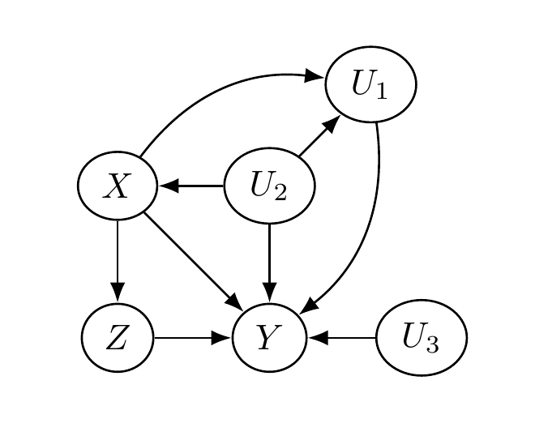
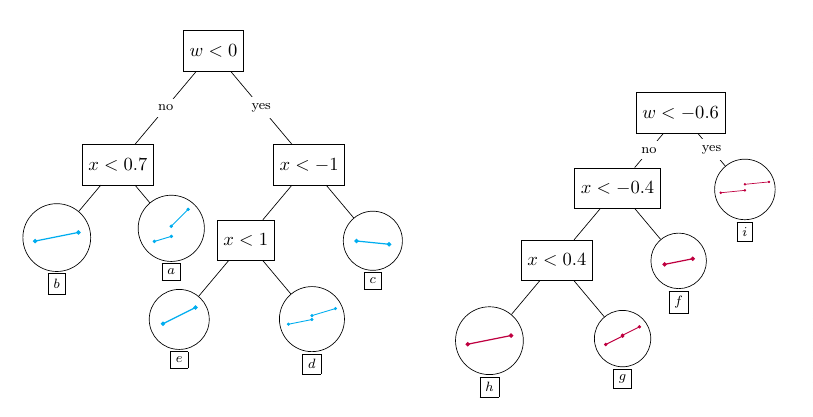
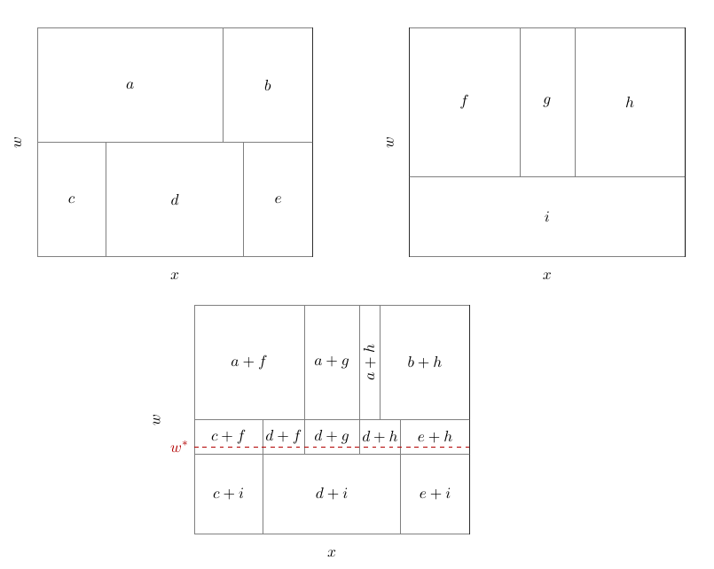
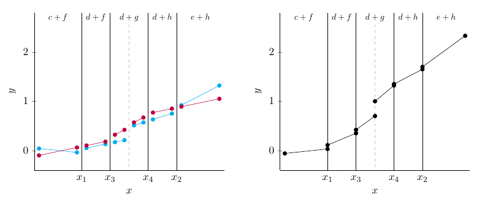

::: {.hidden}
$$
\newcommand{\ind}{\perp \!\!\! \perp}
\newcommand{\B}{\mathcal{B}}
\newcommand{\res}{\mathbf{r}}
\newcommand{\m}{\mathbf{m}}
\newcommand{\x}{\mathbf{x}}
\newcommand{\N}{\mathrm{N}}
\newcommand{\w}{\mathrm{w}}
\newcommand{\iidsim}{\stackrel{\mathrm{iid}}{\sim}}
\newcommand{\V}{\mathbb{V}}
\newcommand{\F}{\mathbf{F}}
\newcommand{\Y}{\mathbf{Y}}
$$
:::

```{r}
#| include: false
reticulate::use_python(
  Sys.getenv("RETICULATE_PYTHON", unset = Sys.which("python3")),
  required = TRUE
)
```

## Introduction

We study conditional average treatment effect (CATE) estimation for regression
discontinuity designs (RDD), in which treatment assignment is based on whether a
particular covariate — referred to as the running variable — lies above or below a
known value, referred to as the cutoff value. Because treatment is deterministically
assigned as a known function of the running variable, RDDs are trivially deconfounded:
treatment assignment is independent of the outcome variable, given the running variable.
However, estimation of treatment effects in RDDs is more complicated than simply
controlling for the running variable, because doing so introduces a complete lack of
overlap. Nonetheless, the CATE _at the cutoff_, $X=c$, may still be identified
provided the conditional expectation $E[Y \mid X,W]$ is continuous at that point for
_all_ $W=w$. We exploit this assumption with the leaf regression BART model implemented
in stochtree, which allows us to define an explicit prior on the CATE.

## Regression Discontinuity Design

We conceptualize the treatment effect estimation problem via a quartet of random
variables $(Y, X, Z, U)$. The variable $Y$ is the outcome variable; $X$ is the running
variable; $Z$ is the treatment assignment indicator; and $U$ represents additional,
possibly unobserved, causal factors. What makes this an RDD is the stipulation that
$Z = I(X > c)$ for cutoff $c$. We assume $c = 0$ without loss of generality.

The following figure depicts a causal diagram representing the assumed causal
relationships between these variables. Two key features are: (1) $X$ blocks the
impact of $U$ on $Z$, satisfying the back-door criterion; and (2) $X$ and $U$ are
not descendants of $Z$.

{width=40% fig-align="center"}

Using this causal diagram, we may express $Y$ as some function of its graph parents
$(X,Z,U)$: $Y = \F(X,Z,U)$. We relate this to the potential outcomes framework via

$$
Y^1 = \F(X,1,U), \qquad Y^0 = \F(X,0,U).
$$

Defining conditional expectations
$$
\mu_1(x) = E[Y \mid X=x, Z=1], \qquad \mu_0(x) = E[Y \mid X=x, Z=0],
$$
the treatment effect function is $\tau(x) = \mu_1(x) - \mu_0(x)$. Because $Z = I(X > 0)$,
we can only learn $\mu_1(x)$ for $X > 0$ and $\mu_0(x)$ for $X < 0$. Overlap is
violated, so the overall ATE $\bar{\tau} = E(\tau(X))$ is unidentified. We instead
estimate $\tau(0) = \mu_1(0) - \mu_0(0)$, which is identified for continuous $X$
under the assumption that $\mu_1$ and $\mu_0$ are suitably smooth at $x = 0$.

### Conditional Average Treatment Effects in RDD

We are concerned with learning not only $\tau(0)$ but also RDD CATEs,
$\tau(0, \w)$ for covariate vector $\w$. Defining potential outcome means

$$
\mu_z(x,\w) = E[Y \mid X=x, W=\w, Z=z],
$$

our treatment effect function is $\tau(x,\w) = \mu_1(x,\w) - \mu_0(x,\w)$. We
must assume $\mu_1(x,\w)$ and $\mu_0(x,\w)$ are suitably smooth in $x$ for every $\w$.
CATE estimation in RDDs then reduces to estimating $E[Y \mid X=x, W=\w, Z=z]$, for
which we turn to BART.

## The BARDDT Model

We propose a BART model where the trees split on $(x,\w)$ but each leaf node parameter
is a vector of regression coefficients tailored to the RDD context. Let $\psi$ denote
the following basis vector:
$$
\psi(x,z) = \begin{bmatrix} 1 & zx & (1-z)x & z \end{bmatrix}.
$$

The prediction function for tree $j$ is defined as $g_j(x, \w, z) = \psi(x, z) \Gamma_{b_j(x, \w)}$
for leaf-specific regression vector $\Gamma_{b_j} = (\eta_{b_j}, \lambda_{b_j}, \theta_{b_j}, \Delta_{b_j})^t$.
The model for observations in leaf $b_j$ is

$$
\Y_{b_j} \mid \Gamma_{b_j}, \sigma^2 \sim \N(\Psi_{b_j} \Gamma_{b_j}, \sigma^2), \qquad
\Gamma_{b_j} \sim \N(0, \Sigma_0),
$$

where we set $\Sigma_0 = \frac{0.033}{J}\mathrm{I}$ as a default (for $x$ standardized
to unit variance in-sample).

This choice of basis entails that the RDD CATE at $\w$, $\tau(0, \w)$, is the sum of
the $\Delta_{b_j(0, \w)}$ elements across all trees:

$$
\tau(0, \w) = \sum_{j=1}^J \Delta_{b_j(0, \w)}.
$$

The priors on the $\Delta$ coefficients directly regularize the treatment effect.

The following figures illustrate how BARDDT fits a response surface and estimates CATEs.

{width=70% fig-align="center"}

{width=70% fig-align="center"}

{width=70% fig-align="center"}

An interesting property of BARDDT: by letting the regression trees split on the running
variable, there is no need to separately define a bandwidth as in polynomial RDD. The
regression trees automatically determine (in the course of posterior sampling) when to
prune away regions far from the cutoff.

## Demo

In this section, we provide code for implementing BARDDT in `stochtree` on a
popular RDD dataset.

### Load Libraries

:::{.panel-tabset group="language"}

## R

```{r}
#| message: false
library(stochtree)
library(rpart)
library(rpart.plot)
library(foreach)
library(doParallel)
```

## Python

```{python}
import matplotlib.pyplot as plt
import seaborn as sns
import numpy as np
import pandas as pd
from sklearn.tree import DecisionTreeRegressor, plot_tree
from stochtree import BARTModel
```

:::

### Dataset

The data comes from @lindo2010ability, who analyze data on college students at a large
Canadian university to evaluate an academic probation policy. Students whose GPA falls
below a threshold are placed on academic probation. The running variable $X$ is the
negative distance between a student's previous-term GPA and the probation threshold, so
students on probation ($Z = 1$) have positive scores and the cutoff is 0. The outcome
$Y$ is the student's GPA at the end of the current term. Potential moderators $W$ are:
gender (`male`), age at university entry (`age_at_entry`), a dummy for being born in
North America (`bpl_north_america`), credits taken in the first year
(`totcredits_year1`), campus indicators (`loc_campus` 1–3), and high school GPA
quantile (`hsgrade_pct`).

:::{.panel-tabset group="language"}

## R

```{r}
data <- read.csv("https://raw.githubusercontent.com/rdpackages-replication/CIT_2024_CUP/refs/heads/main/CIT_2024_CUP_discrete.csv")
y <- data$nextGPA
x <- data$X
x <- x / sd(x)
w <- data[, 4:11]
w$totcredits_year1 <- factor(w$totcredits_year1, ordered = TRUE)
w$male <- factor(w$male, ordered = FALSE)
w$bpl_north_america <- factor(w$bpl_north_america, ordered = FALSE)
w$loc_campus1 <- factor(w$loc_campus1, ordered = FALSE)
w$loc_campus2 <- factor(w$loc_campus2, ordered = FALSE)
w$loc_campus3 <- factor(w$loc_campus3, ordered = FALSE)
c <- 0
n <- nrow(data)
z <- as.numeric(x > c)
h <- 0.1
test <- -h < x & x < h
ntest <- sum(test)
```

## Python

```{python}
data = pd.read_csv("https://raw.githubusercontent.com/rdpackages-replication/CIT_2024_CUP/refs/heads/main/CIT_2024_CUP_discrete.csv")
y = data.loc[:, "nextGPA"].to_numpy()
x = data.loc[:, "X"].to_numpy()
x = x / np.std(x)
w = data.iloc[:, 3:11]

ordered_cat = pd.api.types.CategoricalDtype(ordered=True)
unordered_cat = pd.api.types.CategoricalDtype(ordered=False)
w.loc[:, "totcredits_year1"] = w.loc[:, "totcredits_year1"].astype(ordered_cat)
w.loc[:, "male"] = w.loc[:, "male"].astype(unordered_cat)
w.loc[:, "bpl_north_america"] = w.loc[:, "bpl_north_america"].astype(unordered_cat)
w.loc[:, "loc_campus1"] = w.loc[:, "loc_campus1"].astype(unordered_cat)
w.loc[:, "loc_campus2"] = w.loc[:, "loc_campus2"].astype(unordered_cat)
w.loc[:, "loc_campus3"] = w.loc[:, "loc_campus3"].astype(unordered_cat)
c = 0
n = data.shape[0]
z = np.where(x > c, 1.0, 0.0)
h = 0.1
test = (x > -h) & (x < h)
ntest = int(np.sum(test))
```

:::

### Target Estimand

Our estimand is the CATE function at $x = 0$, i.e. $\tau(0, \w)$. To focus on
feasible estimation points, we restrict to observed $\w_i$ such that $|x_i| \leq \delta$
(here $\delta = 0.1$ after standardizing $X$). Our estimand is therefore

$$
\tau(0, \w_i) \quad \forall i \text{ such that } |x_i| \leq \delta.
$$

### Implementing BARDDT

The $\psi$ basis vector for the leaf regression is
$\psi = [1,\, zx,\, (1-z)x,\, z]$, and the training covariate matrix is
$[x,\, W]$. The prediction basis at the cutoff for $Z=1$ and $Z=0$ is

$$
\psi_1 = [1, 0, 0, 1], \qquad \psi_0 = [1, 0, 0, 0].
$$

:::{.panel-tabset group="language"}

## R

```{r}
fit_barddt <- function(y, x, w, z, test, c,
                       num_gfr = 2, num_mcmc = 500) {
  n <- length(y)
  barddt_global <- list(standardize = TRUE,
                        sample_sigma_global = TRUE,
                        sigma2_global_init = 0.1)
  barddt_mean   <- list(num_trees = 50, min_samples_leaf = 20,
                        alpha = 0.95, beta = 2, max_depth = 20,
                        sample_sigma2_leaf = FALSE,
                        sigma2_leaf_init = diag(rep(0.1 / 50, 4)))
  B    <- cbind(rep(1, n), z * x, (1 - z) * x, z)
  B1   <- cbind(rep(1, n), rep(c, n), rep(0, n), rep(1, n))[test, ]
  B0   <- cbind(rep(1, n), rep(0, n), rep(c, n), rep(0, n))[test, ]
  Xmat <- as.matrix(cbind(rep(0, n), w))[test, ]
  fit  <- stochtree::bart(
    X_train = as.matrix(cbind(x, w)), y_train = y,
    leaf_basis_train = B,
    mean_forest_params = barddt_mean,
    general_params = barddt_global,
    num_gfr = num_gfr, num_mcmc = num_mcmc
  )
  pred1 <- predict(fit, Xmat, B1)$y_hat
  pred0 <- predict(fit, Xmat, B0)$y_hat
  pred1 - pred0
}
```

## Python

```{python}
def estimate_barddt(y, x, w, z, test, c,
                    num_gfr=2, num_mcmc=100, seed=None):
    n = y.shape[0]
    global_params = {"standardize": True,
                     "sample_sigma_global": True,
                     "sigma2_global_init": 0.1}
    if seed is not None:
        global_params["random_seed"] = seed
    mean_params = {"num_trees": 50, "min_samples_leaf": 20,
                   "alpha": 0.95, "beta": 2, "max_depth": 20,
                   "sample_sigma2_leaf": False,
                   "sigma2_leaf_init": np.diag(np.repeat(0.1 / 150, 4))}
    Psi  = np.column_stack([np.ones(n), z * x, (1 - z) * x, z])
    Psi1 = np.column_stack([np.ones(n), np.repeat(c, n),
                             np.zeros(n), np.ones(n)])[test, :]
    Psi0 = np.column_stack([np.ones(n), np.zeros(n),
                             np.repeat(c, n), np.zeros(n)])[test, :]
    Xmat = np.column_stack([np.zeros(n), w])[test, :]
    model = BARTModel()
    model.sample(X_train=np.column_stack([x, w]), y_train=y,
                 leaf_basis_train=Psi, num_gfr=num_gfr, num_mcmc=num_mcmc,
                 general_params=global_params, mean_forest_params=mean_params)
    return model.predict(Xmat, Psi1) - model.predict(Xmat, Psi0)
```

:::

### Fitting the Model

We run multiple chains and combine their posterior draws.

:::{.panel-tabset group="language"}

## R

```{r}
#| cache: true
num_chains <- 20
num_gfr    <- 2
num_mcmc   <- 500

ncores <- min(5, parallel::detectCores() - 1)
cl <- makeCluster(ncores)
registerDoParallel(cl)

chain_outputs <- foreach(i = seq_len(num_chains)) %dopar% {
  fit_barddt(y, x, w, z, test, c,
             num_gfr = num_gfr, num_mcmc = num_mcmc)
}
stopCluster(cl)

pred <- do.call("cbind", chain_outputs)
```

## Python

```{python}
#| cache: true
num_chains <- 4
num_mcmc   <- 100
cate_result = np.empty((ntest, num_chains * num_mcmc))
for i in range(num_chains):
    draws = estimate_barddt(y, x, w, z, test, c,
                            num_gfr=2, num_mcmc=num_mcmc, seed=i)
    cate_result[:, (i * num_mcmc):((i + 1) * num_mcmc)] = draws
```

:::

### Analyzing CATE Heterogeneity

To summarize the CATE posterior we fit a regression tree to the posterior mean
point estimates $\bar{\tau}_i = \frac{1}{M} \sum_{h=1}^M \tau^{(h)}(0, \w_i)$,
using $W$ as predictors. We restrict to observations with $|x_i| \leq \delta$.

:::{.panel-tabset group="language"}

## R

```{r}
#| fig-cap: "Regression tree fit to posterior point estimates of individual treatment effects. Top number in each box is the average subgroup treatment effect; lower number is the share of the sample."
cate <- rpart(y ~ ., data.frame(y = rowMeans(pred), w[test, ]),
              control = rpart.control(cp = 0.015))

plot_cart <- function(rp) {
  fr    <- rp$frame
  left  <- which.min(fr$yval)
  right <- which.max(fr$yval)
  cols  <- rep("lightblue3", nrow(fr))
  cols[fr$yval == fr$yval[left]]  <- "tomato3"
  cols[fr$yval == fr$yval[right]] <- "gold2"
  cols
}

rpart.plot(cate, main = "", box.col = plot_cart(cate))
```

## Python

```{python}
#| fig-cap: "Decision tree fit to posterior mean CATEs, used as an effect moderation summary."
y_surrogate  = np.mean(cate_result, axis=1)
X_surrogate  = w.iloc[test, :]
cate_tree = DecisionTreeRegressor(min_impurity_decrease=0.0001)
cate_tree.fit(X=X_surrogate, y=y_surrogate)
plot_tree(cate_tree, impurity=False, filled=True,
          feature_names=w.columns, proportion=False,
          label="root", node_ids=True)
plt.show()
```

:::

The resulting tree indicates that course load (`totcredits_year1`) in the academic term
leading to probation is a strong moderator of the treatment effect. The tree also flags
campus, age at entry, and gender as secondary moderators — all prima facie plausible.

### Comparing Subgroup Posteriors

The effect moderation tree is a posterior summary tool; it does not alter the
posterior itself. We can compare any two subgroups by averaging their individual
posterior draws. Consider the two groups at opposite ends of the effect range:

- **Group A**: male student, entered college older than 19, attempted > 4.8 credits in
  the first year (leftmost leaf, red)
- **Group B**: any gender, entered college younger than 19, attempted 4.3–4.8 credits
  in the first year (rightmost leaf, gold)

Subgroup posteriors are

$$
\bar{\tau}_A^{(h)} = \frac{1}{n_A} \sum_{i \in A} \tau^{(h)}(0, \w_i),
$$

where $h$ indexes a posterior draw and $n_A$ is the group size.

:::{.panel-tabset group="language"}

## R

```{r}
#| fig-cap: "Joint kernel density estimate of the CATE posteriors for Groups A and B. Nearly all contour lines lie above the 45° line, indicating that Group B has persistently higher treatment effects."
cate_kde <- function(rp, pred) {
  left   <- rp$where == which.min(rp$frame$yval)
  right  <- rp$where == which.max(rp$frame$yval)
  cate_a <- colMeans(pred[left,  , drop = FALSE])
  cate_b <- colMeans(pred[right, , drop = FALSE])
  MASS::kde2d(cate_a, cate_b, n = 200)
}
contour(cate_kde(cate, pred), bty = "n",
        xlab = "Group A", ylab = "Group B")
abline(a = 0, b = 1)
```

## Python

```{python}
#| fig-cap: "Joint KDE of Group A and Group B CATE posteriors. Contours above the diagonal indicate Group B has persistently higher treatment effects."
predicted_nodes  = cate_tree.apply(X=X_surrogate)
posterior_group_a = np.mean(cate_result[predicted_nodes == 2, :], axis=0)
posterior_group_b = np.mean(cate_result[predicted_nodes == 6, :], axis=0)
posterior_df = pd.DataFrame({"group_a": posterior_group_a,
                              "group_b": posterior_group_b})
sns.kdeplot(data=posterior_df, x="group_b", y="group_a")
plt.axline((0, 0), slope=1, color="black", linestyle=(0, (3, 3)))
plt.show()
```

:::

The contour lines are nearly all above the 45° line, indicating that the posterior
probability mass lies in the region where Group B has a larger treatment effect than
Group A, even after accounting for estimation uncertainty.

As always, CATEs that vary with observable factors do not necessarily represent a
_causal_ moderating relationship; uncovering these patterns is crucial for suggesting
causal mechanisms to investigate in future studies.

## References
